# Lesson
# Lab 0: Environment Setup

## Table Of Contents

- [Lesson](#lesson)
- [Lab 0: Environment Setup](#lab-0-environment-setup)
  - [Table Of Contents](#table-of-contents)
  - [Requirements](#requirements)
  - [**Step 1: Installing Visual Studio 2022 Community**](#step-1-installing-visual-studio-2022-community)
  - [**Step 2: Installing and Configuring Git**](#step-2-installing-and-configuring-git)
    - [**Downloading and Configuring Git**](#downloading-and-configuring-git)
    - [**Generating SSH keys**](#generating-ssh-keys)
  - [**Step 3: Configuring GitHub**](#step-3-configuring-github)
    - [**Adding public SSH key to GitHub**](#adding-public-ssh-key-to-github)
    - [**Testing the GitHub SSH key**](#testing-the-github-ssh-key)
  - [**Alternative to Visual Studio 2022**](#alternative-to-visual-studio-2022)
    - [Installing Visual Studio Code](#installing-visual-studio-code)
    - [Installing and testing .NET SDK](#installing-and-testing-net-sdk)
    - [Testing the .NET Installation](#testing-the-net-installation)
- [Conclusion](#conclusion)

## Requirements

To successfully work and complete the lab assignments for the *Distributed Systems* and *Software Engineering* courses, a student **MUST** have following installed on his/her personal computer:

- Visual Studio 2022 Community Edition ([Link](https://visualstudio.microsoft.com/vs/))
- Git ([Link](https://git-scm.com/downloads))
- Personal GitHub account ([Link](https://github.com/))

## **Step 1: Installing Visual Studio 2022 Community**

Download and install Visual Studio 2022 Community from the link in [`Requirements`](#requirements) section.

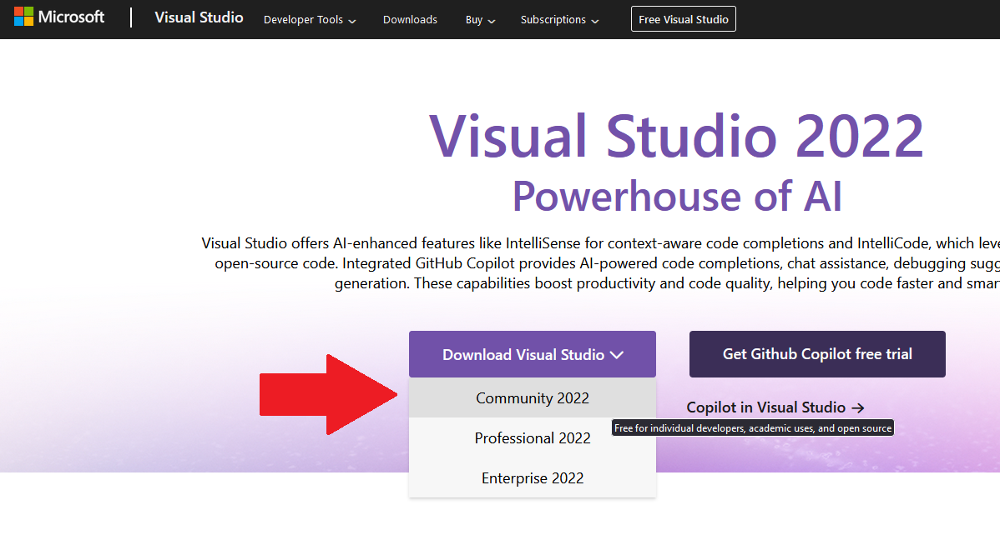

:::caution **IMPORTANT**

During installation, select the `ASP.NET and Web Development` workload:

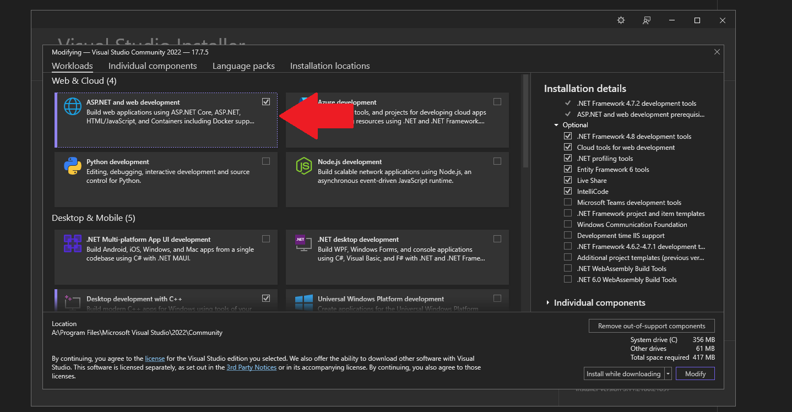

:::

:::tip

In case you have installed Visual Studio without selecting the `ASP.NET and Web Development` workload, or you already have Visual Studio 2022 installed on your system and want to check if you also have the specified workload installed, you can open `Visual Studio`, open any project or `Continoue without code.` and go to toolbar option `Tools` > `Get Tools and Features...`.

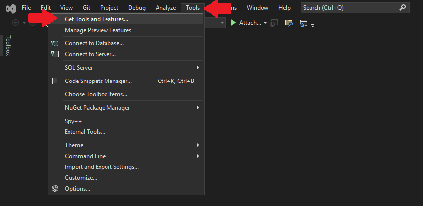

:::

## **Step 2: Installing and Configuring Git**

Git is the most used distributed version control system.
  
### **Downloading and Configuring Git**

Download and install git from the link in [`Requirements`](#requirements).


If you know what you are doing, you can choose Vim as git’s default text editor, otherwise, I recommend using Visual Studio Code.

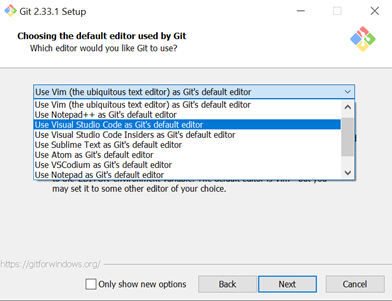

Default branch name doesn’t matter much but it is still best to follow common practices which means naming it `main` branch.


This step enables us to use git from other tools, for example powershell.

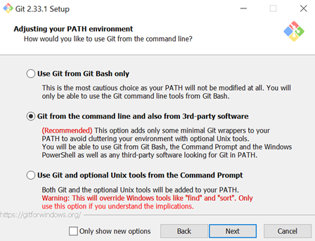

Configure SSH for git as follows:

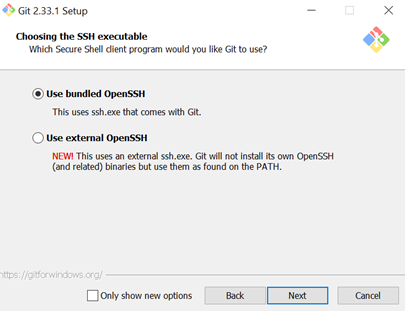
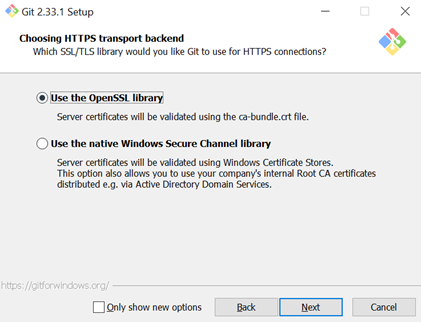

Follow the rest of installation steps and choose default options until git is installed.

### **Generating SSH keys**

:::info **TIP**

For detailed information on GitHub and SSH keys please refer to the [Official GitHub Guide to SSH keys - Part 1](https://docs.github.com/en/authentication/connecting-to-github-with-ssh/generating-a-new-ssh-key-and-adding-it-to-the-ssh-agent) and [Part 2](https://docs.github.com/en/authentication/connecting-to-github-with-ssh/adding-a-new-ssh-key-to-your-github-account)

:::

Git communicates with remote repositories using **SSH** protocol which is secured by private and public keys encryption.

In order for repositories to have access to remote repositories, private SSH keys which are generated locally must be added on remote repository vendors, for example GitHub, bitbucket…

To generate ssh keys, open `powershell` and execute the following command in your terminal:

```powershell
ssh-keygen -t ed25519 -C "your_email@example.com"
```

and press enter for all options (leave the password blank)

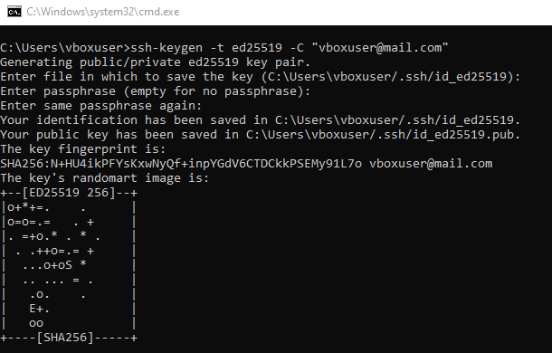

SSH keypair is generated default location as stated
`C:\Users\vboxuser\.ssh\id_ed25519` or more generally `$env:USERPROFILE\.ssh\id_ed25519`.

## **Step 3: Configuring GitHub**

GitHub is a provider of internet hosting for software development and version control using git. **If you do not have a GitHub account, create one before proceeding. Please use your real name and surname.**

### **Adding public SSH key to GitHub**

Open generated public ssh key (id_ed25519.pub file) in text editor and copy all contents (CTRL+a, CTRL+c). The contents should look something like this:

```
ssh-ed25519 AAAAC3NzaC1lZDI1NTE5AAAAILkPEqsQLyPVHJJLLtiK2f25hNc/tbTAOmp04+JPiiBa vboxuser@mail.com
```

:::info **TIP**

Note: You can open the folder from `powershell` by executing:
```powershell
explorer.exe "$env:USERPROFILE\.ssh"
```

:::

In github go to: profile icon > Settings > SSH and GPG keys > New SSH key
Or <https://github.com/settings/keys>
In Title input give name for your SSH key (ex: my-personal-laptop)
In Key input paste copied public SSH key

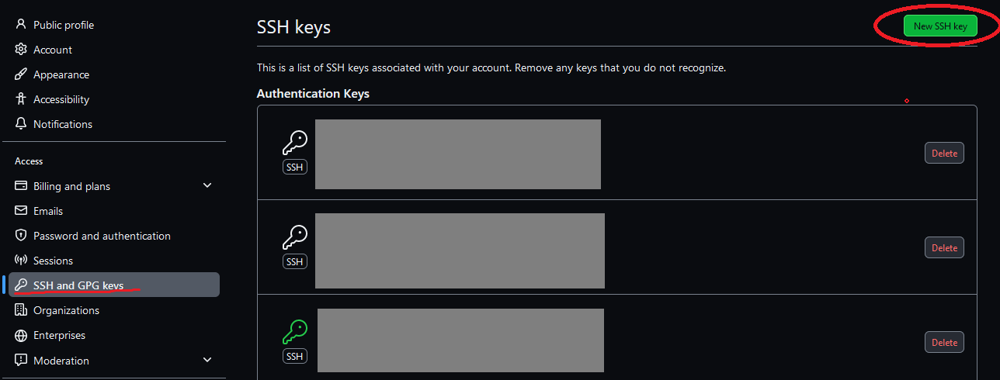

After clicking on the `New SSH Key` button in the upper right corner:

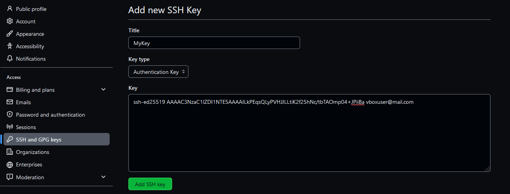

To add keypress, Add SSH key, no error message should be present if everything is done correctly.


### **Testing the GitHub SSH key**

To test if the SSH keys are working successfully, in `cmd` or `powershell` run the following command:
```powershell
ssh -T git@github.com
```

(If you are prompted with a message `The authenticity of host 'github.com (X.X.X.X)' can't be established. [...]`, type `yes` and press `Enter` to verify that you trust the GitHub server.)

:::danger

If the output similar to this:


**Then the SSH keys do not work.** Delete the added keys on the GitHub and repeat previous steps, or ask the assistant for help.

:::

:::tip **SUCCESS**

But, if the output is similar to this:

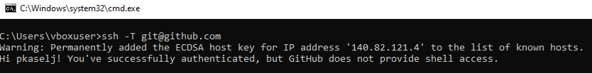

**Congratulations, you have successfully configured Git(Hub) SSH keys.**

:::

## **Alternative to Visual Studio 2022**

:::caution **IMPORTANT**

If you successfully installed Visual Studio 2022 with ASP.NET tools, you can skip this chapter.

:::

In case you have trouble installing Visual Studio 2022 due to not enough memory, using another OS (macOS, UNIX, GNU/Linux, older Windows) or other unspecified issues, you can use `Visual Studio Code` and `.NET 8 SDK`.

### Installing Visual Studio Code

To edit code we can use any text editor, but using specialized software like `Visual Studio Code` allows us to write code more efficiently and easily by providing us with syntax highlighting, autocompletion, linting, etc. To install `Visual Studio Code` go to the [Official Visual Studio Code Website](https://code.visualstudio.com), download and install the Visual Studio Code for your computer.

### Installing and testing .NET SDK

To build and run C# applications, we need a *.NET SDK - Software Development Kit*. To install `.NET 8 SDK` go to the [Official .NET 8 SDK Website](https://dotnet.microsoft.com/en-us/download/dotnet/8.0) and download the `SDK 8.0.403 version` (as seen in image below).

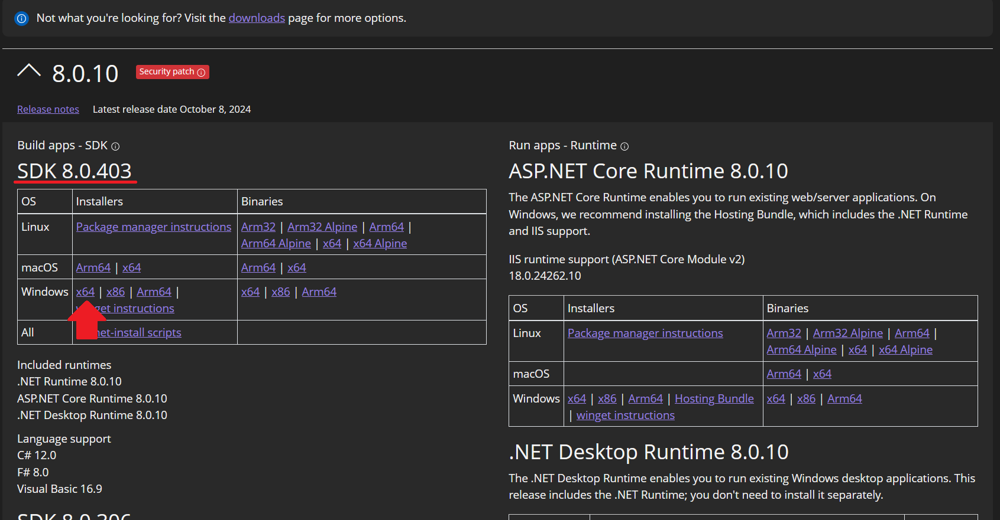

### Testing the .NET Installation

After a short installation, verify the .NET SDK is installed by entering the following command in the `cmd` or `powershell`:

```powershell
dotnet --version
```

:::tip **SUCCESS**

If the output is similar to the one below:

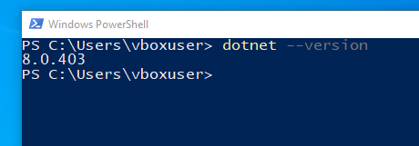

**Congratulations, you have successfully installed .NET SDK on your PC.** 

:::

:::danger

But if the commands throws an error or **shows a different** version, please delete the SDK and install it again following the steps in this document, or ask the assistant for help.

:::


   
# Conclusion

If you have successfully finished all installations, you can proceed with the lab exercises, but if you encounter any errors, please refer to the assistant for help at `petar.kaselj.00@fesb.hr`.