# Lesson
# Threads

## Table Of Contents

- [Lesson](#lesson)
- [Threads](#threads)
  - [Table Of Contents](#table-of-contents)
  - [**Step 0: Prepare Repository**](#step-0-prepare-repository)
  - [**Exercise 1: Creating Responsive UI**](#exercise-1-creating-responsive-ui)
    - [**Create a Project**](#create-a-project)
    - [**Run the Project**](#run-the-project)
  - [**Exercise 2: Creating Threads**](#exercise-2-creating-threads)
    - [**Create a Project**](#create-a-project-1)
    - [**Run the Project**](#run-the-project-1)
  - [**Exercise 3: Managing Threads**](#exercise-3-managing-threads)
    - [**Create a Project**](#create-a-project-2)
    - [**Run the Project**](#run-the-project-2)
  - [**Exercise 4: Using Pools**](#exercise-4-using-pools)
    - [**Create a Project**](#create-a-project-3)
    - [**Run the Project**](#run-the-project-3)
  - [**Exercise 5: Using Tasks**](#exercise-5-using-tasks)
    - [**Create a Project**](#create-a-project-4)
    - [**Run Project**](#run-project)
  - [**Exercise 6: Provoking Races**](#exercise-6-provoking-races)
    - [**Creating Project**](#creating-project)
    - [**Run Project**](#run-project-1)
  - [**Exercise 7: Using async/await**](#exercise-7-using-asyncawait)
    - [**Create a Project**](#create-a-project-5)
    - [**Run Project**](#run-project-2)

## **Step 0: Prepare Repository**
1. Create and clone GitHub repository
2. Create `dev` or `development` branch
3. Create (or modify the existing) `.gitignore` file with the following content: [LINK](https://gist.githubusercontent.com/takekazuomi/10955889/raw/734642c6760915003d36bb124fdae03bb293ae4f/csharp.gitignore)
4. Commit and push `.gitignore` as "Initial commit"

## **Exercise 1: Creating Responsive UI**

In this exercise you will improve responsiveness of a WPF GUI application using threads.

A thread is a single path of execution within a process.

### **Create a Project**

- Create a C# WPF project, named Threads.ResponsiveUi in solution Threads.

```shell
dotnet new sln --name Threads
dotnet new wpf --name Threads.ResponsiveUi
dotnet sln add Threads.ResponsiveUi/Threads.ResponsiveUi.csproj
```

- Add the following code to class `MainWindow.xaml`:

```xml
<Window x:Class="Threads.ResponsiveUi.MainWindow"
        xmlns="http://schemas.microsoft.com/winfx/2006/xaml/presentation"
        xmlns:x="http://schemas.microsoft.com/winfx/2006/xaml"
        xmlns:d="http://schemas.microsoft.com/expression/blend/2008"
        xmlns:mc="http://schemas.openxmlformats.org/markup-compatibility/2006"
        mc:Ignorable="d"
        Title="MainWindow" Height="450" Width="800">
    <Canvas>
        <Button Canvas.Left="50" Canvas.Top="60" Content="Submit" Click="ButtonClick" />
        <Button Canvas.Left="50" Canvas.Top="85" Content="Submit Responsive" Click="ResponsiveButtonClick" />
    </Canvas>
</Window>
```

- Add the following code to class `MainWindow.xaml.cs`:

```csharp
using System;
using System.Diagnostics;
using System.Threading;
using System.Windows;

namespace Threads.ResponsiveUi
{
    /// <summary>
    /// Interaction logic for MainWindow.xaml
    /// </summary>
    public partial class MainWindow : Window
    {
        public MainWindow()
        {
            InitializeComponent();
            PrintThreadingInfoToConsole();
        }

        private static void LengthyOperation()
        {
            int tid = Environment.CurrentManagedThreadId;

            Debug.WriteLine($"Thread {tid} is working ... ");

            Thread.Sleep(7000);

            Debug.WriteLine($"Thread {tid} has finished. ");
        }

        private static void PrintThreadingInfoToConsole()
        {
            var nop = Environment.ProcessorCount;
            Debug.WriteLine($"Your system runs {nop} processors. ");

            var tid = Environment.CurrentManagedThreadId;
            Debug.WriteLine($"Thread {tid} is running ... ");
        }

        private void ButtonClick(object sender, RoutedEventArgs e)
        {
            LengthyOperation();
        }

        private void ResponsiveButtonClick(object sender, RoutedEventArgs e)
        {
            new Thread(LengthyOperation).Start();
        }
    }
}

```

:::tip **For more information:**

[Partial Classes - Microsoft Documentation](https://learn.microsoft.com/en-us/dotnet/csharp/programming-guide/classes-and-structs/partial-classes-and-methods)

:::

### **Run the Project**

Execute the project by executing the following command:

```shell
dotnet run --project .\Threads.ResponsiveUi\Threads.ResponsiveUi.csproj
```

and the output similar to the following will appear:

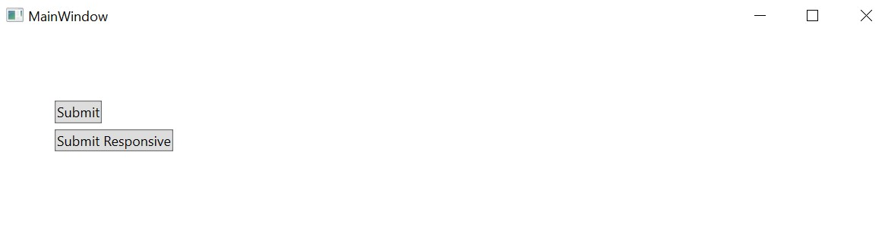

## **Exercise 2: Creating Threads**

In this exercise you will create **threads** that will execute both static and instance methods in threads via delegates.

Threads are implemented in the kernel and *Windows switches **threads not processes***.  

Every thread has:

- The kernel object:
    - It stores information about the thread that is used to perform the context switch. For instance, it contains a copy of the CPU registers.

- The thread environment block (TEB)
    - It stores information such as thread exception handling chain and thread local-storage.

- The user and kernel stacks
    - They store stack frames for executing user and kernel code. The user stack is typically 1M and the kernel stack is typically 24k.

- DLL notification mechanisms
    - Implements mechanisms to inform all DLLs in the process when a thread is created and destroyed. Managed DLLs do not receive these messages. Unmanaged code can disable these messages.

Assigning threads to processors is called the context switch.

In the Windows context switch is performed every 30 ms.

To perform the context switch Windows must:

- Save the registers of the currently running thread.
- Select one thread from the set of existing threads. If the selected thread is in another process Windows must switch the virtual address space.
- Load the registers of the selected thread.
- Be aware that Windows usually must populate caches with new code and data !!!

Each CLR process initially has only one thread called the primary thread which starts in method Main and finishes when Main finishes its execution.

The programmers can:
Create new threads explicitly or
Use threads from the thread pool.

To manage explicit threads, programmers use class `Thread`.

Threads are started in methods with predefined signatures.

Thread methods receive either no parameters or an object and return void.

A thread can be:

- A **foreground** thread
    - Threads used to perform tasks that you want to complete. The application is active until all

- A **background** thread
    - The application (foreground threads) do not wait for background threads. When all foreground threads terminate the process will terminate. Background threads are typically used for tasks that depend on foreground threads - e.g. spelling checking is not necessary when the process is terminated.

The UML of the application you will create is shown below:

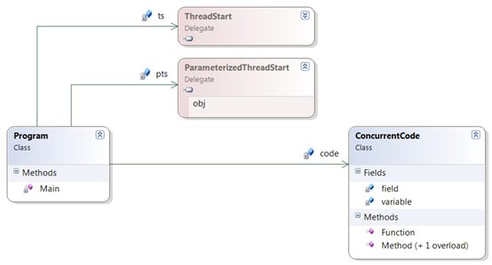

### **Create a Project**

- Create a C# Console project, named CreatingThreads in solution Threads.

```shell
dotnet new console --name Threads.CreatingThreads
dotnet sln add Threads.CreatingThreads/Threads.CreatingThreads.csproj
```

- Add class `ConcurrentCode` to the project.

- Thread methods have predefined signatures. Add the following code to class `ConcurrentCode`:

```csharp
using System;
using System.Threading;

namespace Threads.CreatingThreads
{
    public class ConcurrentCode
    {
        private static int variable = 1;
        private readonly int field = 2;

        public static void Function()
        {
            var name = Thread.CurrentThread.Name;

            Console.WriteLine($"Function: Executing in thread: {name}");
            Console.WriteLine($"Function variable: {variable++}");
            Console.WriteLine("Function: Press any key to terminate.");
            Console.ReadKey();
        }

        public void Method(object? parameter)
        {
            var name = Thread.CurrentThread.Name;
            Console.WriteLine($"Method: Executing in thread: {name}");
            Console.WriteLine($"Method parameter: {parameter}");
            Console.WriteLine($"Method variable: {++variable}");
            Console.WriteLine($"Method field: {field}");
            Console.WriteLine("Method: Press any key to terminate.");
            Console.ReadKey();
        }

        public static void Method(string str, int num)
        {
            var name = Thread.CurrentThread.Name;
            Console.WriteLine($"Method: Executing in thread: {name}");
            Console.WriteLine($"Method str: {str}");
            Console.WriteLine($"Method num: {num}");
            Console.WriteLine("Method: Press any key to terminate.");
            Console.ReadKey();
        }
    }
}
```

- Add the following code to class `Program`:

```csharp
using System;
using System.Threading;

namespace Threads.CreatingThreads
{
    public static class Program
    {

        private static readonly ThreadStart ts = new(ConcurrentCode.Function);
        private static readonly ConcurrentCode code = new();
        private static readonly ParameterizedThreadStart pts = new(code.Method);


        static void Main(string[] args)
        {
            var firstThread = new Thread(ts);
            firstThread.Name = "Zlatni konac litnje zore";
            //firstThread.IsBackground = true;
            firstThread.Start();

            var secondThread = new Thread(pts);
            secondThread.Name = "Der goldene Faden des sommerlichen Morgenrotes";
            secondThread.Priority = ThreadPriority.Highest;
            // secondThread.IsBackground = true;
            secondThread.Start(9);

            var i = 3;
            var thirdThread = new Thread(() => { ConcurrentCode.Method("Iva", i); });
            // thirdThread.IsBackground = true;
            i = 7;
            thirdThread.Start();
        }

    }
}

```

> **NOTE:** [`ThreadStart`](https://learn.microsoft.com/en-us/dotnet/api/system.threading.threadstart?view=net-6.0) and [`ParameterizedThreadStart`](https://learn.microsoft.com/en-us/dotnet/api/system.threading.parameterizedthreadstart?view=net-6.0) official *Microsoft* .NET 6 documentation

### **Run the Project**

Execute the project and the output similar to the following will appear:

```shell
dotnet run --project .\Threads.CreatingThreads\Threads.CreatingThreads.csproj
```

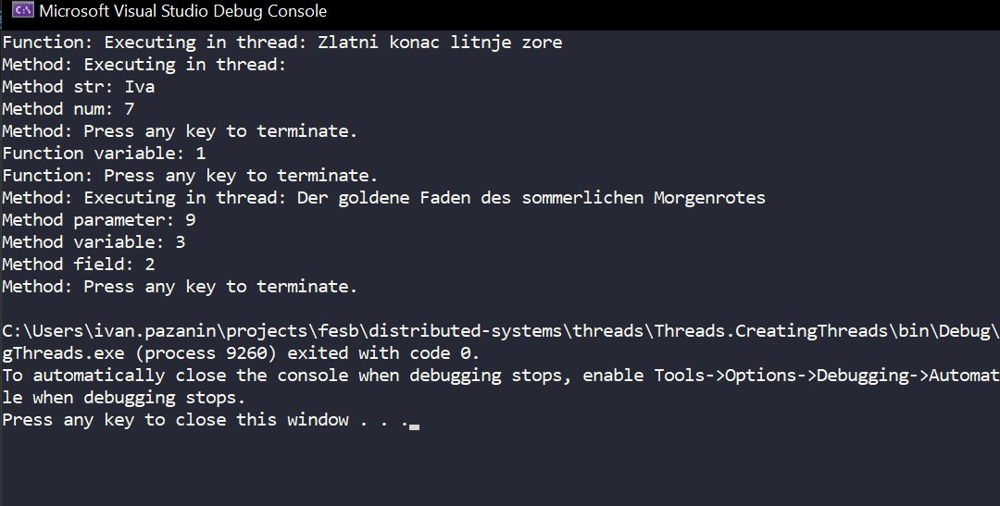

## **Exercise 3: Managing Threads**

In this exercise you will manage threads.

Threads can generally be in three states: **running**, **blocked**, and **ready**.

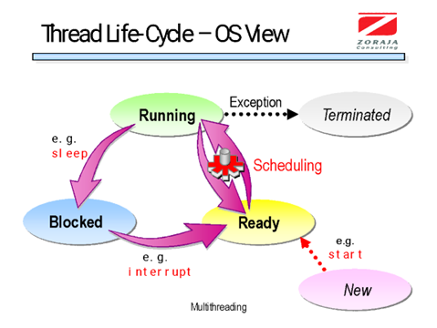

In this exercise, the following methods from class Thread will be used:

- **Sleep**
    - Puts a thread to sleep for a time specified in milliseconds.
- **SpinWait**
    - Causes a thread to wait the number of times defined by the iteration parameter.
- **Interrupt**
    - Wakes up a sleeping thread by raising an exception in the target thread's code.
- **Join**
    - Waits for threads to terminate the execution.

Following methods to manage thread state got **deprecated** because they might cause unexpected behavior if executed while thread is in critical session.

- **Abort**
    - Terminates a thread by raising 2 exceptions in the target thread’s code. Exception will be throw at the end of the finally block one more time if ResetAbort is not called in the catch block.
- **ResetAbort**
    - Prevents itself to be terminated.

In this exercise methods above will be avoided by user defined cancellation behavior.

The following are the classes you will implement in this example:

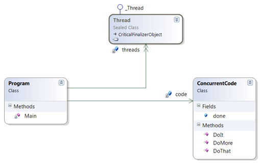

### **Create a Project**

- Create a C# Console project, named `Threads.ManagingThreads` in solution `Threads`.

```shell
dotnet new console --name Threads.ManagingThreads
dotnet sln add .\Threads.ManagingThreads\Threads.ManagingThreads.csproj
```

- Add class `ConcurrentCode` to the project.

- Implement a Class `ConcurrentCode`, as follows:

```csharp
using System;
using System.Threading;

namespace Threads.ManagingThreads
{
    public static class Program
    {
        public static void Main()
        {
            int mid = Thread.CurrentThread.ManagedThreadId;
            Console.WriteLine("Primary Thread ({0}) ", mid);

            Thread workerThread;
            var code = new ConcurrentCode();

            workerThread = new Thread (code.SleepWhileCodeIsNotDone);
            workerThread.Start();
            Thread.Sleep(5000); // Wait some time
            code.done = true;
            workerThread.Join();

            // Token that will self-cancel after 3 seconds
            var cancelTokenSource = new CancellationTokenSource(TimeSpan.FromSeconds(3)); 
            // Action that will be executed when cancelation is requested
            cancelTokenSource.Token.Register(() => { Console.WriteLine("Cancelation token activated!"); }); 
            workerThread = new Thread(() => { code.SleepWhileCancellationIsNotRequested(cancelTokenSource.Token); });
            workerThread.Start();
            workerThread.Join();


            workerThread = new Thread(code.DoSleepForLongTime); // Create an infinite thread
            workerThread.Start();
            Thread.Sleep(5000); // Wait some time
            workerThread.Interrupt();
            workerThread.Join();

            Console.ForegroundColor = ConsoleColor.Red;
            Console.WriteLine("Main: All threads have terminated.");

            Console.ResetColor();
        }
    }
}
```

### **Run the Project**

- Execute the project and the output similar to the following will appear:

```shell
dotnet run --project .\Threads.ManagingThreads\Threads.ManagingThreads.csproj
```

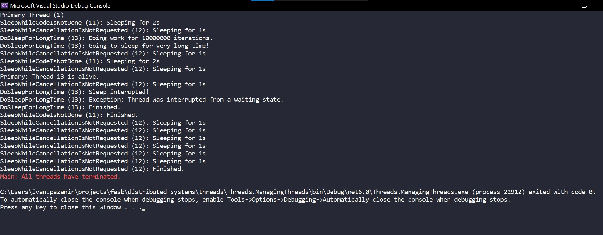

## **Exercise 4: Using Pools**

In this exercise you will use threads from the pool.

Creating and destroying threads is an expensive operation.
Each CLR process has a thread pool that can be reused by the application.
When a pool thread has completed the work it is not destroyed. Instead, it is returned to the pool and stays there in an idle state.

The features of pool threads:

1. Run with the normal priority
2. Run always as Background
3. Used for short-running tasks
4. Cannot be aborted prematurely using Abort or Interrupt.

If you need a thread with different features than those listed above use dedicated threads (created with class Thread)!

To invoke an operation using a pool thread you can call method
QueueUserWorkItem from class ThreadPool.

If the thread method throws an exception that is unhandled the CLR terminates the process.

### **Create a Project**

- Create a C# Console project, named `Threads.UsingPools` in solution `Threads`.

```shell
dotnet new console --name Threads.UsingPools
dotnet sln add Threads.UsingPools/Threads.UsingPools.csproj
```

- Add following code to `Program.cs`:

```csharp
using System;
using System.Threading;

public static class Program
{
    private static readonly ThreadLocal<string> threadLocalData = new();
    private static readonly AsyncLocal<string> asyncLocalData = new();

    static void DoCompute(object? state)
    {
        var managedThreadId = Environment.CurrentManagedThreadId;
        
        Console.WriteLine($"Thread [{managedThreadId}], Task [{state}], BEGIN, Thread L.V. = '{threadLocalData.Value}', Async L.V. = '{asyncLocalData.Value}'");

        Thread.Sleep(TimeSpan.FromSeconds(4));

        Console.WriteLine($"Thread [{managedThreadId}], Task [{state}], END, Thread L.V. = '{threadLocalData.Value}', Async L.V. = '{asyncLocalData.Value}'");
    }

    public static void Main()
    {
        asyncLocalData.Value = "Ana";
        threadLocalData.Value = "Ana";
        
        for (int i = 0; i < 10; i++)
        {
            Thread.Sleep(TimeSpan.FromSeconds(1));
            if (i == 5)
            {
                asyncLocalData.Value = "Marija";
                threadLocalData.Value = "Marija";
                // ExecutionContext.SuppressFlow();
            }
            ThreadPool.QueueUserWorkItem(DoCompute, i);
        }
        Console.WriteLine("Press any key");
        Console.ReadKey();
    }
}
```

### **Run the Project**

Execute the project and the output similar to the following will appear:

```shell
dotnet run --project .\Threads.UsingPools\Threads.UsingPools.csproj
```

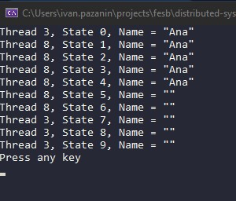

## **Exercise 5: Using Tasks**

In this exercise you will spawn threads using class **Task**.

Using a thread from the pool the programmers doesn't know (there is no built-in support) about:

1. When a thread has completed the execution
2. What is the return value from the thread

Class `Task` overcomes the previous shortcomings.

A Task constructor receives:

- a delegate to the operation to be executed in a thread
- optionally, a CancellationToken object that is used
- optionally, creation options

The return value is generic type specified when we construct a `Task<T>`.

To distinguish a completed task from the faulting one an OperationCanceledException can be thrown.

`Task`'s methods:

- **Start**
    - starts a task
- **Run**
    - creates and starts a task  
- **Wait**
    - waits (blocks) for the task to complete. If the operation in the task throws an exception the thread pool raises an exception in the Wait* or Result methods.
- **WaitAny**
    - waits for any task in the array to complete
- **WaitAll**
    - Waits for all tasks in the array to complete
- **WhenAll**
    - Returns task which is completed when all tasks in the array complete
- **Result**
    - returns a value from the thread

### **Create a Project**

- Create a C# Console project, named `Threads.UsingTasks` in solution `Threads`.

```shell
dotnet new console --name Threads.UsingTasks
dotnet sln add .\Threads.UsingTasks\Threads.UsingTasks.csproj
```

- Add the following code to file `Program.cs`:

```csharp
using System;
using System.Threading;
using System.Threading.Tasks;

class Program
{
    private static int DoComputeSum(int num)
    {
        var managedThreadId = Thread.CurrentThread.ManagedThreadId;
        var total = 0;
        for (int i = 0; i < num; i++)
        {
            total += i;
            Console.WriteLine($"Thread {managedThreadId}, i: {i} total= {total}");
            Thread.Sleep(100);
        }
        return total;
    }

    private static void DoVeryLongAction_NoThrow(CancellationToken token)
    {
        Console.WriteLine("Started very long action.");

        while (true)
        {
            if (token.IsCancellationRequested)
            {
                break;
            }
            Console.WriteLine("Still performing the action...");
            Thread.Sleep(1000);
        }

        Console.WriteLine("Action interrupted!");
    }

    private static void DoVeryLongAction_ThrowException(CancellationToken token)
    {
        Console.WriteLine("Started very long action.");

        while (true)
        {
            token.ThrowIfCancellationRequested();
            Console.WriteLine("Still performing the action...");
            Thread.Sleep(1000);
        }

        Console.WriteLine("Action interrupted!");
    }

    public static void Main()
    {
        var managedThreadId = Environment.CurrentManagedThreadId;
        
        /* Waiting for a simple task to finish */
        var task = new Task<int>(() => DoComputeSum(100));
        task.Start();
        task.Wait();
        Console.WriteLine($"Task finished with the result: '{task.Result}' ");

        /* Interrupting tasks */
        Task veryLongTask;
        CancellationTokenSource cancelTokenSource;

        // Interrupting by setting a flag
        cancelTokenSource = new CancellationTokenSource(TimeSpan.FromSeconds(5));
        veryLongTask = new Task(() => { DoVeryLongAction_NoThrow(cancelTokenSource.Token); });
        veryLongTask.Start();
        veryLongTask.Wait();

        // Interrupting by throwing an execption
        cancelTokenSource = new CancellationTokenSource(TimeSpan.FromSeconds(5));
        veryLongTask = new Task(() => { DoVeryLongAction_ThrowException(cancelTokenSource.Token); });
        veryLongTask.Start();
        try
        {
            veryLongTask.Wait();
            Console.WriteLine("Task exited without problems.");
        }
        catch (AggregateException ex)
        {
            Console.WriteLine($"Caught exception: '{ex.Message}' from: \n{ex.StackTrace}");
        }
    }
}
```

### **Run Project**

- Execute the project and the output similar to the following will appear:

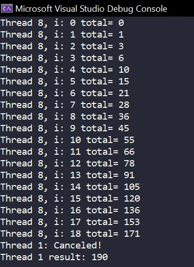

## **Exercise 6: Provoking Races**

In this exercise you will create threads that will execute shared code which executions will result in a race condition.

Each thread can have an assigned priority which is relative to the process priority.

Here is the UML class diagram of the classes you will implement:

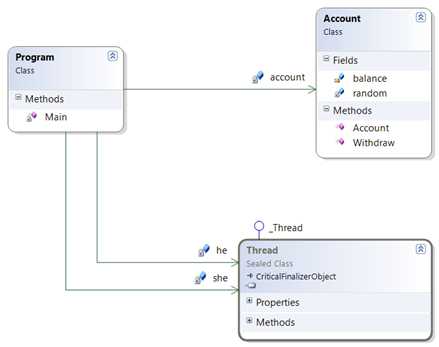

### **Creating Project**

- Create a C# Console project, named `Threads.ProvokingRaces` in solution `Threads`.

```shell
dotnet new console --name Threads.ProvokingRaces
dotnet sln add Threads.ProvokingRaces/Threads.ProvokingRaces.csproj
```

- Add following code to file `Program.cs`

```csharp
using System;
using System.Threading.Tasks;
using System.Collections.Generic;
using System.Diagnostics;

class Program
{
    private const int IncrementAmount = 10000;
    private static int sum = 0;
    private static readonly object incrementLock = new();
    private static readonly Stopwatch stopwatch = new();

    private static void IncrementSumSynchronously()
    {
        Console.WriteLine("Incrementing sum synchronously");

        stopwatch.Restart();
        for (var i = 0; i < IncrementAmount; i++)
        {
            sum++;
        }
        stopwatch.Stop();

        Console.WriteLine($"Duration: {stopwatch.Elapsed}, Sum value: {sum}");
    }

    private static void IncrementSumParallel_NoLock()
    {
        Console.WriteLine("Incrementing sum parallel");

        var allIncrementTasks = new List<Task>();

        stopwatch.Restart();
        for (var i = 0; i < IncrementAmount; i++)
        {
            var incrementTask = new Task(() => sum++);
            incrementTask.Start();
            allIncrementTasks.Add(incrementTask);
        }

        var allTasksFinishedTask = Task.WhenAll(allIncrementTasks);
        allTasksFinishedTask.Wait();
        stopwatch.Stop();

        Console.WriteLine($"Duration: {stopwatch.Elapsed}, Sum value: {sum}");
    }

    private static void IncrementSumParallel_WithLock()
    {
        Console.WriteLine("Incrementing sum parallel WITH a lock");

        var allIncrementTasks = new List<Task>();

        stopwatch.Restart();
        for (var i = 0; i < IncrementAmount; i++)
        {
            var incrementTask = new Task(() =>
            {
                lock (incrementLock)
                {
                    sum++;
                }
            });
            incrementTask.Start();
            allIncrementTasks.Add(incrementTask);
        }

        var allTasksFinishedTask = Task.WhenAll(allIncrementTasks);
        allTasksFinishedTask.Wait();
        stopwatch.Stop();

        Console.WriteLine($"Duration: {stopwatch.Elapsed}, Sum value: {sum}");
    }

    public static void Main()
    {
        IncrementSumSynchronously();
        sum = 0;
        IncrementSumParallel_NoLock();
        sum = 0;
        IncrementSumParallel_WithLock();
    }
}
```

### **Run Project**

- Execute the project and the output similar to the following will appear:

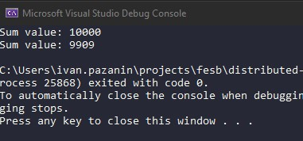

## **Exercise 7: Using async/await**

In this exercise you will use async await statements to write asynchronous code ins synchronous matter.

The Task asynchronous programming model (TAP) provides an abstraction over asynchronous code.
You write code as a sequence of statements, just like always.
You can read that code as though each statement completes before the next begins.
The compiler performs many transformations because some of those statements may start work and return a Task that represents the ongoing work.

The **await** keyword provides a non-blocking way to start a task, then continue execution when that task completes
Methods which should be started in non-blocking way always must have **async** modifier in its signature.
That signals to the compiler that this method contains an **await** statement; it contains asynchronous operations.

### **Create a Project**

- Create a C# Console project, named `Threads.AsyncAwait` in solution `Threads`.

```shell
dotnet new console --name Threads.AsyncAwait
dotnet sln add Threads.AsyncAwait/Threads.AsyncAwait.csproj
```

- Add following code to file `Program.cs`:

```csharp
using System;
using System.Collections.Generic;
using System.Diagnostics;
using System.Threading.Tasks;

class Program
{
    private const int NumberOfIterations = 10;
    private const int ThreadPoolSize = 2;
    private static readonly TimeSpan WorkDuration = TimeSpan.FromSeconds(5);
    private static readonly Stopwatch stopwatch = new();
    private static void Work()
    {
        Task.Delay(WorkDuration).Wait();
    }
    private static async Task AsyncWork()
    {
        await Task.Delay(WorkDuration);
    }

    private static void DoWorkSynchronously()
    {
        for (var i = 0; i < NumberOfIterations; i++)
        {
            Work();
        }
    }

    private static void DoWorkOnSeparateThreads()
    {
        var threads = new List<Thread>();
        for (var i = 0; i < NumberOfIterations; i++)
        {
            var thread = new Thread(Work);
            threads.Add(thread);
            thread.Start();
        }
        
        threads.ForEach(t => t.Join());
    }

    private static void DoWorkOnThreadPool()
    {
        using var finishedCounter = new CountdownEvent(NumberOfIterations);

        var options = new ParallelOptions();
        options.MaxDegreeOfParallelism = ThreadPoolSize;

        _ = Parallel.For(0, NumberOfIterations, options, (_) => { Work(); });
    }

    private static async Task DoWorkParallel()
    {
        var tasks = new List<Task>();
        for (var i = 0; i < NumberOfIterations; i++)
        {
            var task = new Task(() => Work());
            task.Start();
            tasks.Add(task);
        }
        await Task.WhenAll(tasks);
    }

    private static async Task DoWorkParallelAsync()
    {
        var tasks = new List<Task>();
        for (int i = 0; i < NumberOfIterations; i++)
        {
            var task = new Task(async () => await AsyncWork());
            task.Start();
            tasks.Add(task);
        }
        await Task.WhenAll(tasks);
    }

    public static async Task Main()
    {
        Console.WriteLine($"Started synchronous work.");
        stopwatch.Restart();
        DoWorkSynchronously();
        stopwatch.Stop();
        var syncCodeDuration = stopwatch.Elapsed;
        Console.WriteLine($"Synchronous code Duration {syncCodeDuration}");

        Console.WriteLine($"Started multi threaded work.");
        stopwatch.Restart();
        DoWorkOnSeparateThreads();
        stopwatch.Stop();
        var multiThreadCodeDuration = stopwatch.Elapsed;
        Console.WriteLine($"Multi threaded Duration {multiThreadCodeDuration}");

        Console.WriteLine($"Started thread pool work.");
        stopwatch.Restart();
        DoWorkOnThreadPool();
        stopwatch.Stop();
        var threadPoolDuration = stopwatch.Elapsed;
        Console.WriteLine($"Thread pool code Duration {threadPoolDuration}");

        Console.WriteLine($"Started parallel work.");
        stopwatch.Restart();
        await DoWorkParallel();
        stopwatch.Stop();
        var parallelCodeDuration = stopwatch.Elapsed;
        Console.WriteLine($"Parallel blocking code duration {parallelCodeDuration}");

        Console.WriteLine($"Started asynchronous parallel work.");
        stopwatch.Restart();
        await DoWorkParallelAsync();
        stopwatch.Stop();
        var asyncParallelCodeDuration = stopwatch.Elapsed;
        Console.WriteLine($"Asynchronous parallel code duration {asyncParallelCodeDuration}");
    }
}
```

### **Run Project**

- Execute the project and the output similar to the following will appear:

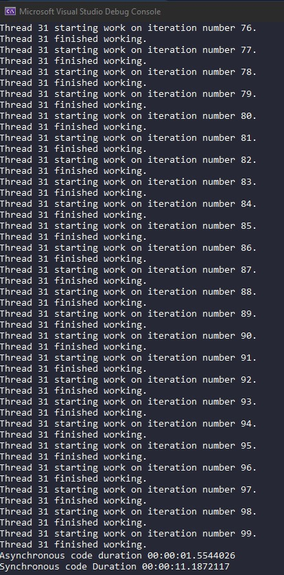

- Increase value of `NumberOfIterations` and observe changes to execution times!
