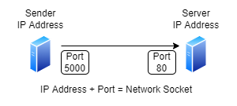
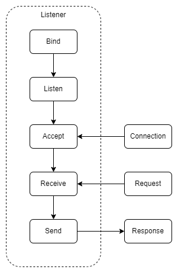
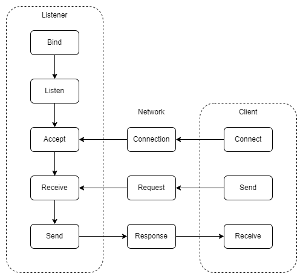
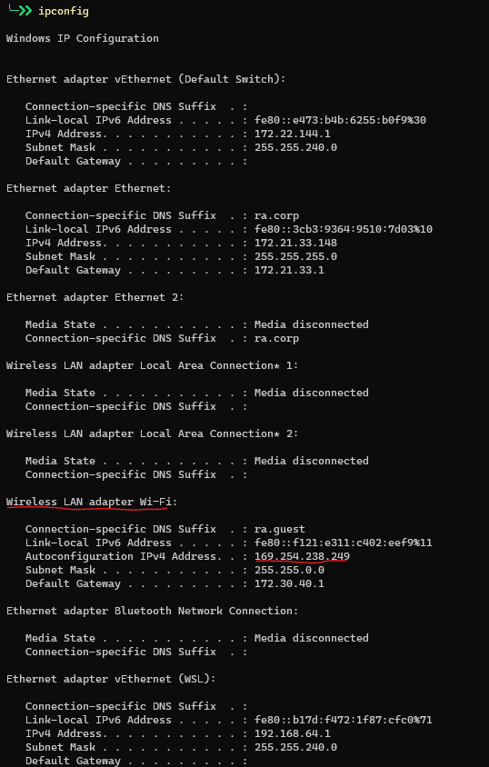
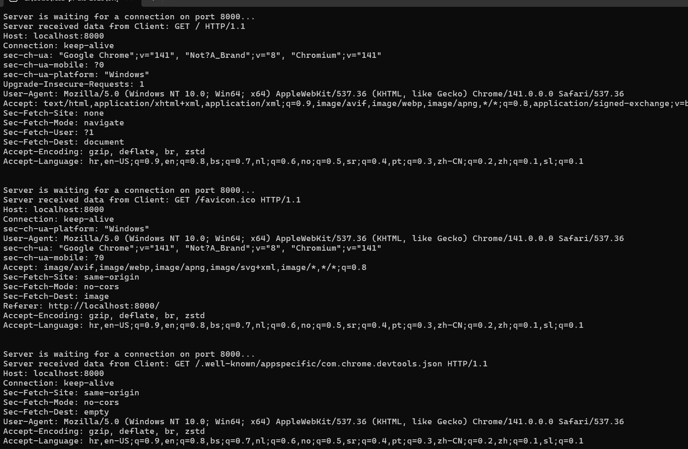
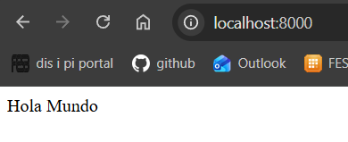

# Lesson
# Lab 4: Communication Protocols

## **Table of Contents**

- [Lesson](#lesson)
- [Lab 4: Communication Protocols](#lab-4-communication-protocols)
  - [**Table of Contents**](#table-of-contents)
    - [**Objectives**](#objectives)
  - [**Exercise 1: Creating listener socket**](#exercise-1-creating-listener-socket)
    - [**Create solution**](#create-solution)
    - [**Create Socket Listener**](#create-socket-listener)
  - [**Exercise 2: Creating client socket**](#exercise-2-creating-client-socket)
  - [**Exercise 3: Test code**](#exercise-3-test-code)
    - [**Loopback IP address**](#loopback-ip-address)
    - [**Any IP address**](#any-ip-address)
  - [**Exercise 4: Simple HTTP Socket server**](#exercise-4-simple-http-socket-server)
    - [**Simple HTTP Server:**](#simple-http-server)
  - [**Exercise 5: HTTP Client and Listener**](#exercise-5-http-client-and-listener)
    - [Create project](#create-project)
    - [Implement HTTP Server](#implement-http-server)
    - [Implement HTTP Client](#implement-http-client)
    - [Run the project](#run-the-project)
  - [**Firewall Issues**](#firewall-issues)
    - [Add and Remove Exception for Inbound TCP Connection](#add-and-remove-exception-for-inbound-tcp-connection)
    - [Add and Remove Exception for Inbound UDP Connection](#add-and-remove-exception-for-inbound-udp-connection)

### **Objectives**

Modern applications use TCP/IP as network layer protocols for communication between distant devices.

A **network socket** is a software structure within a network node
of a computer network that serves as an endpoint for sending and
receiving data across the network.



**Network socket** consists of **IP address** used to
identify machine on network and **TCP port** used to
identify application on machine.

## **Exercise 1: Creating listener socket**

Listener socket is socket which waits for incoming connection on defined
**network socket**.
Once connection is established listener reads request message,
returns some response message and closes connection.



### **Create solution**

- Create new solution: `dotnet new sln --name CommunicationProtocols`
- Create server project: `dotnet new console --name CommunicationProtocols.Server`
- Create client project: `dotnet new console --name CommunicationProtocols.Client`
- Add projects to the solution:

```shell
dotnet sln add CommunicationProtocols.Server/CommunicationProtocols.Server.csproj
dotnet sln add CommunicationProtocols.Client/CommunicationProtocols.Client.csproj
```

### **Create Socket Listener**

C# has OOP implementation of Berkeley Socket library in namespace `System.Net.Sockets`.

In Server project implement:

- Create new file and class `SocketServer` which
    - Add following namespaces to file:

    ```csharp
    using System.Net;
    using System.Net.Sockets;
    ```

    - receives `portNumber` in constructor as dependency and maps it to field
    - has buffer to receive incoming data:

```csharp
  private readonly byte[] _requestDataBuffer = new byte[1024];
```

- Create method `public void` `StartListening` which receives `string responseData` to send as response to client
- Method `StartListening` creates socket that binds to loopback IP address and port received from constructor:

```csharp
        var ipAddress = IPAddress.Loopback;
        var localEndPoint = new IPEndPoint(ipAddress, _portNumber);

        // Create a TCP/IP listener socket.  
        var listenerSocket = new Socket(
            addressFamily: ipAddress.AddressFamily,
            socketType: SocketType.Stream,
            protocolType: ProtocolType.Tcp);        
```

- Using method `Bind` and `Listen` on `listenerSocket`, prepare socket for incoming connections

- In method `StartListening` create infinite loop in which socket will accept and respond to incoming connections:

```csharp
        while (true)
        {
            Console.WriteLine($"Waiting for a connection on port {_portNumber}...");
            // Start listening for connections.  
            AcceptConnectionAndSendResponse(listenerSocket, responseData);
        }
```

- Implement method `private void AcceptConnectionAndSendResponse(Socket listener, string responseData)`:
    - That receives `handler` socket using `listener.Accept()` method
    - Puts data from `handler` socket into buffer `var bytesReceived = handler.Receive(_requestDataBuffer, _requestDataBuffer.Length, SocketFlags.None)`
    - Decodes received data using method `Encoding.UTF8.GetString` and displays it on console
    - Encodes `responseData` into `Encoding.UTF8` with method `GetBytes`
    - Sends encoded bytes using `handler.Send` method
    - Closes `handler` socket using `handler.Close` method

- In `Main` in class `Program` ad following code:

```csharp
        var socketServer = new SocketServer(8000);
        socketServer.StartListening("Hola Mundo de SocketServer");
```

## **Exercise 2: Creating client socket**

Client socket is socket which connects to remote
socket, sends some request and reads response.



In Client project implement:

- Create new file and class `SocketClient`
    - which receives `portNumber` in constructor as dependency and maps it to fields
    - has field

     ```csharp
     private readonly byte[] _responseDataBuffer = new byte[1024];
     ```

- Create method `public void SendMessage` which sends `string requestData` to listener
- Method `SendMessage` creates socket that connects to loopback IP address and port received from constructor

```csharp
        var ipAddress = IPAddress.Loopback;
        var remoteEndPoint = new IPEndPoint(ipAddress, _portNumber);

        // Create a TCP/IP socket.
        var sender = new Socket(
            addressFamily: ipAddress.AddressFamily,
            socketType: SocketType.Stream,
            protocolType: ProtocolType.Tcp);
```

- Connect to remote socket using method `sender.Connect`
- Send **UTF8** encoded data (`string requestData`) using `sender.Send` method
- Receive **UTF8** encoded data using `Receive(_responseDataBuffer)` and write it to console
- Decode received data from **UTF8** to string and display it to console
- close connection using methods `sender.ShutDown(SocketShutdown.Both)` and `sender.Close`
- In class `Program` implement method `Main`:

```csharp
        var clientSocket = new SocketClient(8000);

        clientSocket.SendMessage("Hola Mundo de Client");
```

## **Exercise 3: Test code**

### **Loopback IP address**

- Start server project

```shell
dotnet run --project CommunicationProtocols.Server/CommunicationProtocols.Server.csproj
```

- Start client project
  
```shell
dotnet run --project CommunicationProtocols.Client/CommunicationProtocols.Client.csproj
```

- You should see following output:

```shell
$ dotnet run --project CommunicationProtocols.Server/CommunicationProtocols.Server.csproj
Server is waiting for a connection on port 8000...
Server received data from Client: Hola Mundo de Client
Server is waiting for a connection on port 8000...
```

```shell
$ dotnet run --project CommunicationProtocols.Client/CommunicationProtocols.Client.csproj
Client is about to send data to server
Client received data from server:Hola Mundo de Server
```

### **Any IP address**

This example has been using Loopback IP address so far which limits usage for only this machine.
But with simple tweak this code can be changed to ping any IP address.

You can expose your device to local network machines by finding out your local IP address and binding server to this ip address.

- use `ipconfig` (`ifconfig` for linux and mac) command in terminal network adapter IP address:
  


(If you are connected via wire, use ethernet adapter)

- instantiate IP address using read bytes:

```csharp
var ipAddress = new IPAddress(new byte[] { 169, 254, 238, 249 });
```

Connect to remote device using its IP address when creating client socket.
Port numbers must also be same!

Run projects and you should be able to communicate over wire using sockets!

## **Exercise 4: Simple HTTP Socket server**

**HTTP** is application layer protocol which defines how data is exchanged between server and client.

**HTTP message:**

- A Request-line
- Zero or more header (General|Request|Entity) fields followed by CRLF
- An empty line (i.e., a line with nothing preceding the CRLF) indicating the end of the header fields
- Optionally a message-body

**HTTP Request message:**

```shell
GET /doc/test.html HTTP/1.1
Host: www.test101.com
Connection: keep-alive
Content-Type: text/html
Content-Length: 345

This is message body line 1
This is message body line 2
```

**HTTP Response:**

```shell
HTTP/1.1 200 OK
Date: Sun, 10 Oct 2010 23:26:07 GMT
Server: Apache/2.2.8 (Ubuntu) mod_ssl/2.2.8 OpenSSL/0.9.8g
Last-Modified: Sun, 26 Sep 2010 22:04:35 GMT
ETag: "45b6-834-49130cc1182c0"
Accept-Ranges: bytes
Content-Length: 12
Connection: close
Content-Type: text/html

Hello world!
```

### **Simple HTTP Server:**

- Modify Socket server to return valid HTTP response by returning as response:

```csharp
var statusLine = "HTTP/1.1 200 OK\r\n";
var responseHeader = "Content-Type: text/html\r\n";
var responseBody = $"<!DOCTYPE html><html><head><title>Hello World!</title></head><body><div>Hola Mundo</div></body></html>";
var httpResponse = $"{statusLine}{responseHeader}\r\n{responseBody}";
```

- Start server
- Using browser access server via address `http:\\localhost:8000`
- You should se following as output





## **Exercise 5: HTTP Client and Listener**

**.NET** framework provides built in support for HTTP:

- `System.Net.HttpListener` - listening for HTTP connections
- `System.Net.HttpClient` - creating HTTP requests

- Create simple HTTP server with same functionalities as HTTP Socket server from previous exercise using `HttpListener`
- Create HTTP client to ping HTTP server using `HttpClient` and write response to console
- Run projects and verify everything is working correctly

### Create project

- Create Projects `CommunicationProtocols.HttpServer` and `CommunicationProtocols.HttpClient` and add them to solution:

```shell
dotnet new console --name CommunicationProtocols.HttpServer
dotnet new console --name CommunicationProtocols.HttpClient
dotnet sln add CommunicationProtocols.HttpServer/CommunicationProtocols.HttpServer.csproj
dotnet sln add CommunicationProtocols.HttpClient/CommunicationProtocols.HttpClient.csproj
```

### Implement HTTP Server

- Add following implementation to class `Server`:

```csharp
public static class Server
{
    public static async Task Listen()
    {
        var listener = new HttpListener();
        listener.Prefixes.Add($"http://localhost:8008/");

        listener.Start();

        Console.WriteLine("Server is listening...");
        try
        {
            while (true)
            {
                // Note: The GetContext method blocks while waiting for a request.
                var context = await listener.GetContextAsync();

                Console.WriteLine("Server got request...");

                // Obtain a response object.
                var response = context.Response;

                // Construct a response.
                var responseString = "<html><body> Hola Mundo!</body></html>";
                var buffer = System.Text.Encoding.UTF8.GetBytes(responseString);

                // Get a response stream and write the response to it.
                response.ContentLength64 = buffer.Length;

                var output = response.OutputStream;
                await output.WriteAsync(buffer);

                // You must close the output stream.
                output.Close();
            }
        }
        catch
        {
            listener.Stop();
        }
    }
}
```

- In `Main` method asynchronously call method `Listen` on class `Server`

### Implement HTTP Client

- Add following implementation to class `Client`:

```csharp
public static class Client
{
    public static async Task Call()
    {
        var httpClient = new System.Net.Http.HttpClient();

        var httpRequestMessage = new HttpRequestMessage()
        {
            Method = HttpMethod.Get,
            RequestUri = new Uri("http://localhost:8008/")
        };

        var response = await httpClient.SendAsync(httpRequestMessage);

        var responseContent = await response.Content.ReadAsStringAsync();

        Console.WriteLine($"Received from server: {responseContent}");
    }
}
```

- In `Main` method asynchronously call method `Call` on class `Client`

### Run the project

- Start HTTP server:

```shell
dotnet run --project CommunicationProtocols.HttpServer/CommunicationProtocols.HttpServer.csproj
```

- Open browser on URL: `http://localhost:8008/`

- You should see following result in browser:

```shell
Hola Mundo!
```

- Run the client

```shell
dotnet run --project CommunicationProtocols.HttpClient/CommunicationProtocols.HttpClient.csproj
```

- You should see following output:

```shell
$ dotnet run --project CommunicationProtocols.HttpClient/CommunicationProtocols.HttpClient.csproj
Received from server: <html><body> Hola Mundo!</body></html>
```

## **Firewall Issues**

:::caution **IMPORTANT**

In some cases, Windows Firewall may block the communication between processes on different computers. To fix that, follow the instructions below. 

:::

:::caution **IMPORTANT**

Following commands must be executed with elevated privileges i.e. as Administrator or they may fail. Either open Powershell `As Administrator` in Start Menu or press `Windows key + R` type `powershell` and press `Ctrl + Shift + ENTER`.

:::

### Add and Remove Exception for Inbound TCP Connection

The command to open an inbound port `1234` for `TCP` communication on computer, run the following command:

```powershell
New-NetFirewallRule -DisplayName "PI_DIS_TCP_Exception" -Direction Inbound -Action Allow -Protocol TCP -LocalPort 1234
```

to remove it run:

```powershell
Remove-NetFirewallRule -DisplayName "PI_DIS_TCP_Exception"
```

### Add and Remove Exception for Inbound UDP Connection

The command to open an inbound port `1234` for `UDP` communication on computer, run the following command:

```powershell
New-NetFirewallRule -DisplayName "PI_DIS_UDP_Exception" -Direction Inbound -Action Allow -Protocol UDP -LocalPort 1234
```

to remove it run:

```powershell
Remove-NetFirewallRule -DisplayName "PI_DIS_UDP_Exception"
```


