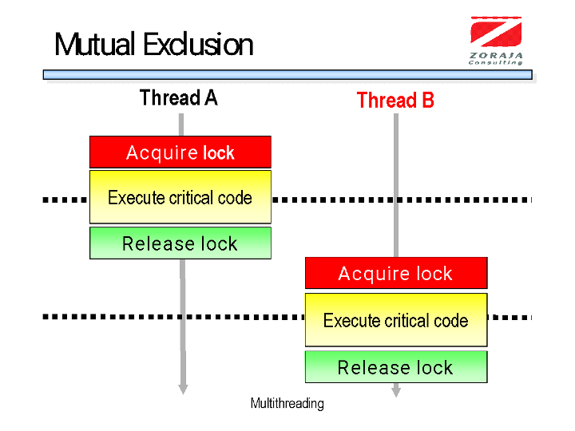
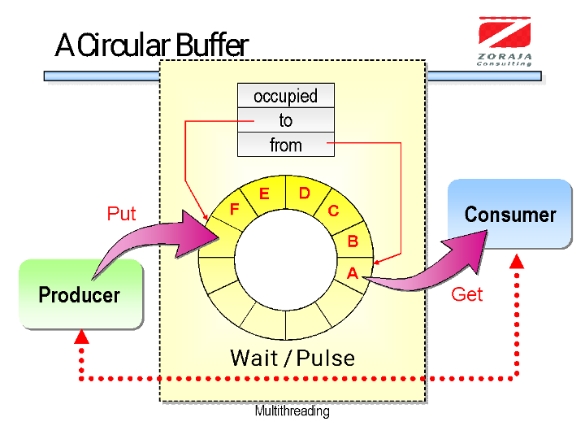
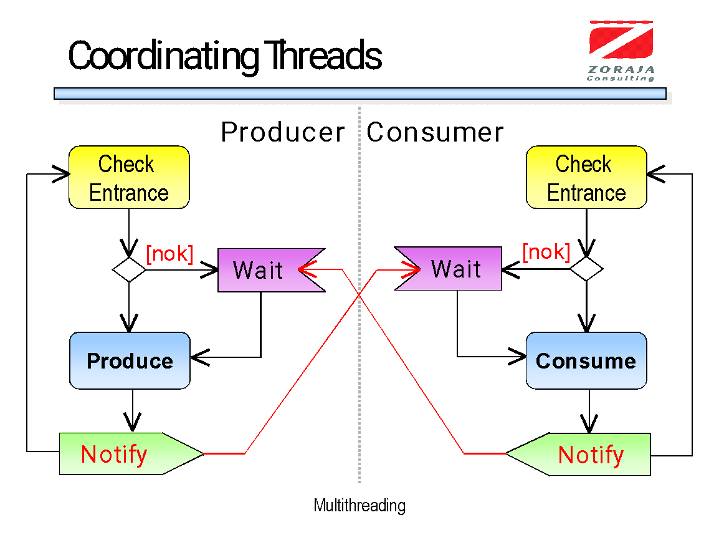
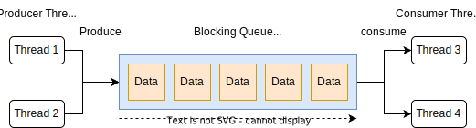
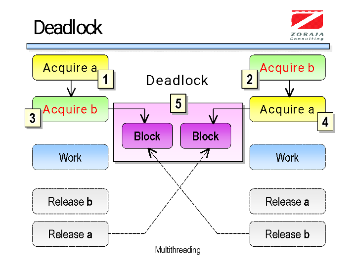

# Lesson
# Lab 3: Synchronization

## Table Of Contents

- [Lesson](#lesson)
- [Lab 3: Synchronization](#lab-3-synchronization)
  - [Table Of Contents](#table-of-contents)
  - [**Exercise 1: Utilizing Multiple Cores**](#exercise-1-utilizing-multiple-cores)
    - [**Create a Project**](#create-a-project)
    - [**Run Project**](#run-project)
  - [**Exercise 2: Implementing Spin-Locks**](#exercise-2-implementing-spin-locks)
    - [**Create a Project**](#create-a-project-1)
    - [**Run the project**](#run-the-project)
  - [**Exercise 3: Using Kernel-mode Synchronizations**](#exercise-3-using-kernel-mode-synchronizations)
    - [**Create a Project**](#create-a-project-2)
    - [**Run the project**](#run-the-project-1)
  - [**Exercise 4: Producer and Consumer**](#exercise-4-producer-and-consumer)
    - [**Create a Project**](#create-a-project-3)
    - [**Run the project**](#run-the-project-2)
  - [**Exercise 5: Multiple Producers and Consumers**](#exercise-5-multiple-producers-and-consumers)
    - [**Create a Project**](#create-a-project-4)
    - [**Run the project**](#run-the-project-3)
  - [**Exercise 6: Provoking a Deadlock**](#exercise-6-provoking-a-deadlock)
    - [**Create a Project**](#create-a-project-5)
    - [**Run the project**](#run-the-project-4)
  - [**Exercise 7: Avoiding Deadlocks**](#exercise-7-avoiding-deadlocks)
    - [**Create a Project**](#create-a-project-6)
    - [**Run the project**](#run-the-project-5)
  - [**Homework**](#homework)
    - [**Setup**](#setup)

## **Exercise 1: Utilizing Multiple Cores**

In this exercise you will use methods from .NET framework to perform atomic (uninterruptable) updates on primitive data types.

The overheads of using threads:

1. Starting a thread
2. Scheduling a thread (context switch)
3. Synchronizing a thread (+ associated (big) problems)
4. Cache misses
5. Destroying a thread

Advice: Avoid 1, 3, and 4!!!

If you access shared variables (e.g. static and instance fields) you should use synchronization mechanisms.

Local variables are not shared unless they are passed to lambda expressions. In that case, local variables are implicitly captured into objects by the compiler.

Thread-safety in FCL methods:

- All FCL static methods are thread-safe. Most parameters are passed by value and FCL internally they use locks only if necessary.
- Instance methods are not thread-safe since the overhead of locking would hurt performance.

Primitives (methods) that are used for synchronization can be:

- User-mode constructs
    - They are fast since they use special CPU instructions to coordinate threads.
    - Windows and thread pool do not detect that a thread blocks using these synchronization primitives.
    - But, you cannot suspend a thread waiting on a user-mode synchronization primitive.

- Kernel-mode constructs
    - Synchronization primitives are implemented in the Windows kernel so a transition for user to kernel mode is executed.
    - The kernel is able to suspend threads that wait on these synchronization constructs.

- Hybrid constructs
    - Run as non-blocking when there is no contention. When there is a contention thread are blocked by the operating system.

In .NET you can use the following user-mode constructs:

- Volatile Constructs
    - These constructs are used to perform atomic read or atomic write operations but they cannot be combined into atomic read/modify/write operations.

- Interlocked operations
    - These constructs provide atomic read/modify/write operations.  They all are full memory fences.

A **memory fence** ensures that:

- All writes before an interlocked method are executed before the call to the Interlocked method.
- All reads after the call to the interlocked method must execute after the call to the interlocked method.  

### **Create a Project**

- Create a C# Console project, named `Synchronization.AtomicOperations` in solution `Synchronization`.

```shell
dotnet new sln --name Synchronization
dotnet new console --name Synchronization.AtomicOperations
dotnet sln add Synchronization.AtomicOperations/Synchronization.AtomicOperations.csproj
```

- Use the following namespaces in file `Program.cs`:

```csharp
using System;
using System.Threading;
using System.Threading.Tasks;
```

- Add following constants and fields to class `Program`:

```csharp
private const int IncrementAmount = 10_000;
private static volatile int s_volatileSum;
private static int s_interlockedSum;
private static int s_normalSum;
```

- Implement method `IncrementSums` as follows:

```csharp
private static void IncrementSums()
{
    for (var i = 0; i < IncrementAmount; i++)
    {
        s_volatileSum++;
        _ = Interlocked.Increment(ref s_interlockedSum);
        s_normalSum++;
    }
}
```

- Implement method `Main` as follows:

```csharp
public static async Task Main()
{
    var numberOfCores = Environment.ProcessorCount;
    Console.WriteLine($"You have {numberOfCores} cores installed.");

    var tasks = new List<Task>();

    foreach (var _ in Enumerable.Range(0, numberOfCores))
    {
        var task = Task.Run(IncrementSums);
        tasks.Add(task);
    }

    await Task.WhenAll(tasks);

    Console.WriteLine($"Volatile sum: {s_volatileSum}");
    Console.WriteLine($"Interlocked sum: {s_interlockedSum}");
    Console.WriteLine($"Normal sum: {s_normalSum}");
}
```

### **Run Project**

Execute the project and the output similar to the following will appear:

```shell
$ dotnet run --project Synchronization.AtomicOperations/Synchronization.AtomicOperations.csproj
You have 10 cores installed.
Volatile sum: 99769
Interlocked sum: 100000
Normal sum: 99989
```

## **Exercise 2: Implementing Spin-Locks**

In this exercise you will use user level constructs to implement spin waiting.



### **Create a Project**

- Create a C# Console project, named `Synchronization.InterlockedOperations` in solution `Synchronization`.

```shell
dotnet new console --name Synchronization.InterlockedOperations
dotnet sln add Synchronization.InterlockedOperations/Synchronization.InterlockedOperations.csproj
```

- Use the following namespaces in file Program.cs:

```csharp
using System;
using System.Threading;
using System.Threading.Tasks;
```

- Add following implementation to method `AddNumbers`:

```csharp
    private static void AddNumbers()
    {
        var threadId = Environment.CurrentManagedThreadId;
        while (Interlocked.Exchange(ref s_locker, 1) != 0)
        {
            Console.WriteLine($"Thread {threadId} is waiting for lock to release");
            Thread.Sleep(300);
        }

        Console.WriteLine($"Thread {threadId} has acquired lock");

        s_total += 5;
        Console.WriteLine("total = " + s_total);

        s_total -= 2;
        Console.WriteLine("total = " + s_total);

        s_total *= 2;
        Console.WriteLine("total = " + s_total);

        Console.WriteLine($"Thread {threadId} is about to release lock");
        Thread.VolatileWrite(ref s_locker, 0);
    }
```

- Add following implementation to method `Main`:

```csharp
    public static async Task Main()
    {
        var tasks = new[]
        {
            Task.Run(() => AddNumbers()),
            Task.Run(() => AddNumbers()),
            Task.Run(AddNumbers),
        };

        await Task.WhenAll(tasks);
    }
```

### **Run the project**

- Execute the project and the output similar to the following will appear:

```shell
$ dotnet run --project Synchronization.InterlockedOperations/Synchronization.InterlockedOperations.csproj
Thread 4 has acquired lock
Thread 6 is waiting for lock to release
total = 5
total = 3
total = 6
Thread 7 is waiting for lock to release
Thread 4 is about to release lock
Thread 6 has acquired lock
total = 11
total = 9
total = 18
Thread 6 is about to release lock
Thread 7 is waiting for lock to release
Thread 7 has acquired lock
total = 23
total = 21
total = 42
Thread 7 is about to release lock
```

## **Exercise 3: Using Kernel-mode Synchronizations**

In this exercise you will use kernel mode synchronizations.

### **Create a Project**

- Create a C# Console project, named `Synchronization.KernelSynchronizations` in solution `Synchronization`.

```shell
dotnet new console --name Synchronization.KernelSynchronizations
dotnet sln add Synchronization.KernelSynchronizations/Synchronization.KernelSynchronizations.csproj
```

- Add following fields to class `Program`:

```csharp
    private static readonly AutoResetEvent s_autoRaiseEvent = new(false);
    private static readonly Semaphore s_semaphore = new(1, 2);
    private static readonly Random s_random = new();
    private static readonly object s_lock = new();
```

- Add following implementation to method `DoSomething`:

```csharp
    private static void DoSomething()
    {
        Console.WriteLine("Waiting for auto raise event to be signaled ...");
        _ = s_autoRaiseEvent.WaitOne();
        Console.WriteLine("autoRaiseEvent is signaled.");
    }
```

- Add following implementation to method `DoConcurrentOperationWithSemaphore`:

```csharp
    private static async Task DoConcurrentOperationWithSemaphore()
    {
        var managedThreadId = Environment.CurrentManagedThreadId;

        try
        {
            Console.WriteLine($"Thread {managedThreadId} is waiting to enter semaphore");

            _ = s_semaphore.WaitOne();

            Console.WriteLine($"Thread {managedThreadId} entered semaphore");

            await Task.Delay(TimeSpan.FromSeconds(1));

            var randomNumber = s_random.Next(0, 3);

            if (randomNumber == 1)
            {
                throw new NotSupportedException($"Uh oh, bad thing happened in thread {managedThreadId}");
            }
        }
        catch (NotSupportedException)
        {
            Console.ForegroundColor = ConsoleColor.Red;
            Console.WriteLine($"Exception occurred on thread {managedThreadId}");
            Console.ResetColor();
        }
        finally
        {
            Console.WriteLine($"Thread {managedThreadId} is about to exit semaphore");
            _ = s_semaphore.Release();
        }
    }
```

- Add following implementation to method `DoConcurrentOperationWithLock`:

```csharp
    private static void DoConcurrentOperationWithLock()
    {
        var managedThreadId = Environment.CurrentManagedThreadId;

        Console.WriteLine($"Thread {managedThreadId} is waiting to enter lock");
        lock (s_lock)
        {
            Console.WriteLine($"Thread {managedThreadId} entered lock");

            Thread.Sleep(TimeSpan.FromSeconds(1));
        }

        Console.WriteLine($"Thread {managedThreadId} left lock");

    }
```

- Add following implementation to method `Main`:

```csharp
    public static async Task Main()
    {
        var autoRaiseEventTask = Task.Run(DoSomething);

        Console.WriteLine("Press any key to signal raise autoRaiseEvent signal ...");
        _ = Console.ReadKey();

        _ = s_autoRaiseEvent.Set();

        await autoRaiseEventTask;

        var semaphoreTasks = new[]
        {
            Task.Run(DoConcurrentOperationWithSemaphore),
            Task.Run(DoConcurrentOperationWithSemaphore),
            Task.Run(DoConcurrentOperationWithSemaphore),
            Task.Run(DoConcurrentOperationWithSemaphore),
            Task.Run(() => DoConcurrentOperationWithSemaphore()),
        };
        await Task.WhenAll(semaphoreTasks);

        var lockTasks = new[]
        {
            Task.Run(DoConcurrentOperationWithLock),
            Task.Run(DoConcurrentOperationWithLock),
            Task.Run(() => DoConcurrentOperationWithLock()),
        };
        await Task.WhenAll(lockTasks);

        s_autoRaiseEvent.Dispose();
        s_semaphore.Dispose();
    }
```

### **Run the project**

- Execute the project and the output similar to the following will appear:

```shell
$ dotnet run --project Synchronization.KernelSynchronizations/Synchronization.KernelSynchronizations.csproj
Press any key to signal raise autoRaiseEvent signal ...
Waiting for auto raise event to be signaled ...
autoRaiseEvent is signaled.
Thread 7 is waiting to enter semaphore
Thread 11 is waiting to enter semaphore
Thread 7 entered semaphore
Thread 12 is waiting to enter semaphore
Thread 8 is waiting to enter semaphore
Thread 9 is waiting to enter semaphore
Thread 7 is about to exit semaphore
Thread 11 entered semaphore
Thread 11 is about to exit semaphore
Thread 12 entered semaphore
Exception occurred on thread 12
Thread 12 is about to exit semaphore
Thread 8 entered semaphore
Thread 8 is about to exit semaphore
Thread 9 entered semaphore
Exception occurred on thread 9
Thread 9 is about to exit semaphore
Thread 12 is waiting to enter lock
Thread 12 entered lock
Thread 8 is waiting to enter lock
Thread 11 is waiting to enter lock
```

## **Exercise 4: Producer and Consumer**

In this exercise you will implement a classical synchronization problem.

A producer produces items and stores them in a shared buffer.
The consumer takes items from the buffer and consumes them.




The following steps are vital for the algorithm:

- When the buffer is full the producer goes to sleep
- When the buffer is empty the consumer goes to sleep
- When there is one empty slot in the buffer the consumer wakes up the producer
- When there is one full slot in the buffer the producer wakes up the consumer.

The programmer should avoid **deadlocks** and/or **starvation's**.

### **Create a Project**

- Create a C# Console project, named `Synchronization.ProducerConsumer` in solution `Synchronization`:

```shell
dotnet new console --name Synchronization.ProducerConsumer
dotnet sln add Synchronization.ProducerConsumer/Synchronization.ProducerConsumer.csproj
```

- Create and implement class `SharedBuffer` in new file:

```csharp
using System;
using System.Threading;

namespace Synchronization.ProducerConsumer;

public class SharedBuffer
{
    private readonly int[] _buffer = new int[10];
    private int _numberOfOccupiedElements;
    private int _elementIndexToPut;
    private int _elementIndexToTakeFrom;

    private readonly object _locker = new();
}
```

- In class `SharedBuffer` implement method `PutElement`:

```csharp
    public void PutElement(int element)
    {
        var managedThreadId = Environment.CurrentManagedThreadId;
        lock (_locker)
        {
            while (_numberOfOccupiedElements == _buffer.Length)
            {
                Console.WriteLine($"Thread {managedThreadId} is waiting");
                _ = Monitor.Wait(_locker);
            }

            _buffer[_elementIndexToPut] = element;
            _numberOfOccupiedElements++;
            _elementIndexToPut = (_elementIndexToPut + 1) % _buffer.Length;

            for (var i = 0; i < _buffer.Length; i++)
                Console.Write("{0:d2} ", _buffer[i]);
            Console.WriteLine(" ");

            Monitor.Pulse(_locker);
        }
    }
```

- In class `SharedBuffer` implement method `GetElement`:

```csharp

    public int GetElement()
    {
        var managedThreadId = Environment.CurrentManagedThreadId;

        lock (_locker)
        {
            while (_numberOfOccupiedElements == 0)
            {
                Console.WriteLine($"Thread {managedThreadId} is waiting");
                _ = Monitor.Wait(_locker);
            }

            var element = _buffer[_elementIndexToTakeFrom];
            _buffer[_elementIndexToTakeFrom] = 0;
            _numberOfOccupiedElements--;
            _elementIndexToTakeFrom = (_elementIndexToTakeFrom + 1) % _buffer.Length;

            for (var i = 0; i < _buffer.Length; i++)
            {
                Console.Write($"{_buffer[i]:d2} ");
            }

            Console.WriteLine("");

            Monitor.Pulse(_locker);

            return element;
        }
    }
```

- Create and implement class `Producer` in new file:

```csharp
public class Producer
{
    private readonly SharedBuffer _buffer;
    private readonly Random _random = new();

    public Producer(SharedBuffer buffer)
    {
        _buffer = buffer;
    }

    public void Produce()
    {
        for (var i = 0; i < 100; i++)
        {
            Thread.Sleep(_random.Next(1, 200));
            _buffer.PutElement(i);
        }
    }
}
```

- Create and implement class `Consumer` in new file:

```csharp
public class Consumer
{
    private readonly SharedBuffer _buffer;
    private readonly Random _random = new();

    public Consumer(SharedBuffer buffer)
    {
        _buffer = buffer;
    }

    public void Consume()
    {
        var sum = 0;

        for (var i = 0; i < 100; i++)
        {
            Thread.Sleep(_random.Next(1, 500));
            sum += _buffer.GetElement();
        }

        Console.WriteLine("Sum should be " + (99 * 100 / 2));
        Console.WriteLine("Thank you kleine Karl: " + sum);
    }
}
```

- Add following fields to class `Program`:

```csharp
    private static readonly SharedBuffer s_buffer = new();
    private static readonly Producer s_producer = new(s_buffer);
    private static readonly Consumer s_consumer = new(s_buffer);
```

- Implement method `Main` in class `Program`:

```csharp
    public static async Task Main()
    {
        var t1 = Task.Run(s_producer.Produce);
        var t2 = Task.Run(s_consumer.Consume);

        await Task.WhenAll(t1, t2);
    }
```

### **Run the project**

- Execute the project and the output similar to the following will appear:

```shell
$ dotnet run --project Synchronization.ProducerConsumer/Synchronization.ProducerConsumer.csproj
Thread 6 is waiting
00 00 00 00 00 00 00 00 00 00
00 00 00 00 00 00 00 00 00 00
00 01 00 00 00 00 00 00 00 00
00 00 00 00 00 00 00 00 00 00
00 00 02 00 00 00 00 00 00 00
00 00 02 03 00 00 00 00 00 00
00 00 00 03 00 00 00 00 00 00
00 00 00 03 04 00 00 00 00 00
00 00 00 00 04 00 00 00 00 00
00 00 00 00 04 05 00 00 00 00
00 00 00 00 04 05 06 00 00 00
00 00 00 00 04 05 06 07 00 00
00 00 00 00 04 05 06 07 08 00
00 00 00 00 00 05 06 07 08 00
00 00 00 00 00 05 06 07 08 09
10 00 00 00 00 05 06 07 08 09
10 11 00 00 00 05 06 07 08 09
10 11 12 00 00 05 06 07 08 09
10 11 12 00 00 00 06 07 08 09
10 11 12 13 00 00 06 07 08 09
10 11 12 13 14 00 06 07 08 09
10 11 12 13 14 00 00 07 08 09
10 11 12 13 14 15 00 07 08 09
10 11 12 13 14 15 00 00 08 09
10 11 12 13 14 15 16 00 08 09
...
```

## **Exercise 5: Multiple Producers and Consumers**

In this exercise you will use C# `System.Threading.Channels.Channel` to implement multiple producers and consumers:



### **Create a Project**

- Create a C# Console project, named `Synchronization.MultipleProducersConsumers` in solution `Synchronization`:

```shell
dotnet new console --name Synchronization.MultipleProducersConsumers
dotnet sln add Synchronization.MultipleProducersConsumers/Synchronization.MultipleProducersConsumers.csproj
```

- Create and implement class `Producer` in new file:

```csharp
public class Producer
{
    private readonly Random _random = new();
    private readonly string _name;
    private readonly ChannelWriter<int> _channelWriter;

    public Producer(string name, ChannelWriter<int> writer)
    {
        _name = name;
        _channelWriter = writer;
    }

    public async Task Produce()
    {
        for (var i = 0; i < 100; i++)
        {
            var delay = TimeSpan.FromMilliseconds(_random.Next(1, 200));
            await Task.Delay(delay);
            await _channelWriter.WriteAsync(i);
            Console.WriteLine($"Producer {_name} wrote {i} to channel.");
        }
    }
}
```

- Create and implement class `Consumer` in new file:

```csharp
public class Consumer
{
    private readonly Random _random = new();
    private readonly string _name;
    private readonly ChannelReader<int> _channelReader;

    public Consumer(string name, ChannelReader<int> channelReader)
    {
        _name = name;
        _channelReader = channelReader;
    }

    public async Task<int> Consume()
    {
        var sum = 0;

        await foreach (var data in _channelReader.ReadAllAsync())
        {
            var delay = TimeSpan.FromMilliseconds(_random.Next(1, 500));
            await Task.Delay(delay);
            sum += data;
            Console.WriteLine($"Consumer {_name} read {data} from channel.");
        }

        return sum;
    }
}
```

- Add following field to class `Program`:

```csharp
    private static readonly Channel<int> s_channel = Channel.CreateBounded<int>(new BoundedChannelOptions(10)
    {
        FullMode = BoundedChannelFullMode.Wait,
    });
```

- Add following implementation to method `Main` in class `Program`:

```csharp
    public static async Task Main()
    {
        var producers = new[]
        {
            new Producer("Producer1", s_channel.Writer),
            new Producer("Producer2",s_channel.Writer),
            new Producer("Producer3",s_channel.Writer),
        };

        var producerTasks = new List<Task>();

        foreach (var producer in producers)
        {
            var producerTask = producer.Produce();
            producerTasks.Add(producerTask);
        }

        var consumers = new[]
        {
            new Consumer("Consumer1", s_channel.Reader),
            new Consumer("Consumer2", s_channel.Reader),
        };

        var consumerTasks = new List<Task<int>>();
        foreach (var consumer in consumers)
        {
            var consumerTask = consumer.Consume();
            consumerTasks.Add(consumerTask);
        }

        await Task.WhenAll(producerTasks);

        s_channel.Writer.Complete();

        var sum = 0;
        foreach (var consumerTask in consumerTasks)
        {
            sum += await consumerTask;
        }

        System.Console.WriteLine($"Expected sum: {99 * 100 / 2 * producers.Length}");
        System.Console.WriteLine($"Actual sum: {sum}");
    }
```

### **Run the project**

- Execute the project and the output similar to the following will appear:

```shell
$ dotnet run --project Synchronization.MultipleProducersConsumers/Synchronization.MultipleProducersConsumers.csproj
Producer Producer2 wrote 0 to channel.
Producer Producer1 wrote 0 to channel.
Producer Producer1 wrote 1 to channel.
Producer Producer2 wrote 1 to channel.
Producer Producer2 wrote 2 to channel.
Producer Producer1 wrote 2 to channel.
Producer Producer2 wrote 3 to channel.
Producer Producer1 wrote 3 to channel.
Consumer Consumer1 read 0 from channel.
Consumer Consumer3 read 1 from channel.
...
Consumer Consumer2 read 98 from channel.
Consumer Consumer3 read 96 from channel.
Consumer Consumer1 read 99 from channel.
Consumer Consumer2 read 99 from channel.
Expected sum: 9900
Actual sum: 9900
```

## **Exercise 6: Provoking a Deadlock**

In this exercise you will provoke a deadlock when two threads are trying to acquire two different locks in the same order.



### **Create a Project**

- Create a C# Console project, named `Synchronization.ProvokingDeadLock` in solution `Synchronization`:

```shell
dotnet new console --name Synchronization.ProvokingDeadLock
dotnet sln add Synchronization.ProvokingDeadLock/Synchronization.ProvokingDeadLock.csproj
```

- Create and implement class `Account` in new file:

```csharp
public class Account
{
    private object _locker = new();
    private readonly string _name;
    private decimal _balance;

    public Account(string name, decimal balance)
    {
        _name = name;
        _balance = balance;
    }

    public void Withdraw(decimal amount)
    {
        _balance -= amount;
    }

    public void Deposit(decimal amount)
    {
        _balance += amount;
    }

    public override string ToString()
    {
        return $"Ballance: {_balance}";
    }
}

```

- Implement method `Transfer` in class `Account`:

```csharp
    public void Transfer(Account other, decimal amount)
    {
        if (other is null)
        {
            return;
        }

        var managedThreadId = Environment.CurrentManagedThreadId;

        lock (_locker)
        {
            Console.WriteLine($"Account {_name} Thread {managedThreadId} acquired lock 1.");
            Thread.Sleep(1000);

            Console.WriteLine($"Account {_name} Thread {managedThreadId} trying to acquire lock 2.");

            lock (other._locker)
            {
                Console.WriteLine($"Account {_name} Thread {managedThreadId} acquired lock 2.");

                Withdraw(amount);
                other.Deposit(amount);
                Console.WriteLine($"Account {_name} Thread {managedThreadId} performed transfer and is releasing lock 2.");
            }

            Console.WriteLine($"Thread {managedThreadId} is releasing 1.");
        }
    }
```

- Add following fields to class `Program`:

```csharp
    private static readonly Account s_firstAccount = new("First Account", 200);
    private static readonly Account s_secondAccount = new("Second Account", 300);
```

- Implement method `Main` in class `Program`:

```csharp
        var t1 = Task.Run(() => s_firstAccount.Transfer(s_secondAccount, 100));
        //var t2 = Task.Run(() => a.Transfer(b, 100));
        var t2 = Task.Run(() => s_secondAccount.Transfer(s_firstAccount, 100));

        await Task.WhenAll(t1, t2);

        Console.WriteLine($"Balances: {s_firstAccount} {s_secondAccount}");
```

### **Run the project**

- Execute the project and the output similar to the following will appear:

```shell
$ dotnet run --project Synchronization.ProvokingDeadLock/Synchronization.ProvokingDeadLock.csproj
Account Second Account Thread 6 acquired lock 1.
Account First Account Thread 4 acquired lock 1.
Account First Account Thread 4 trying to acquire lock 2.
Account Second Account Thread 6 trying to acquire lock 2.

```

## **Exercise 7: Avoiding Deadlocks**

In this exercise you will use kernel synchronization primitives to avoid deadlocks situations.

### **Create a Project**

- Create a C# Console project, named `Synchronization.Mutexes` in solution `Synchronization`:

```shell
dotnet new console --name Synchronization.Mutexes
dotnet sln add Synchronization.Mutexes/Synchronization.Mutexes.csproj
```

- Create and implement class `Account` in new file:

```csharp
using System;
using System.Threading;

namespace Synchronization.Mutexes;

public class Account
{
    private const int Timeout = 10000;
    private readonly string _name;
    private decimal _balance;
    private readonly Mutex _mutex = new();

    public Account(string name, decimal balance)
    {
        _name = name;
        _balance = balance;
    }

    public void Withdraw(decimal amount)
    {
        _balance -= amount;
    }

    public void Deposit(decimal amount)
    {
        _balance += amount;
    }

    public override string ToString()
    {
        return $"Account: {_name} Ballance: {_balance}";
    }
}
```

- Implement method `Transfer` in class `Account`:

```csharp
    public void Transfer(Account other, decimal amount)
    {
        if (other is null)
        {
            return;
        }

        var managedThreadId = Environment.CurrentManagedThreadId;

        Mutex[] lockers = { _mutex, other._mutex };

        if (WaitHandle.WaitAll(lockers, Timeout))
        {
            try
            {
                Console.WriteLine($"Account {_name} T{managedThreadId}: All locks are acquired.");

                Withdraw(amount);
                Thread.Sleep(1000);
                other.Deposit(amount);

                Console.WriteLine($"Account {_name} T{managedThreadId}: Transfer is performed.");
            }
            finally
            {
                foreach (var mutex in lockers)
                {
                    mutex.ReleaseMutex();
                }

                Console.WriteLine($"Account {_name} T{managedThreadId}: All locks are released.");
            }
        }
    }
```

- Add following fields to class `Program`:

```csharp
    private static readonly Account s_firstAccount = new("First", 200);
    private static readonly Account s_secondAccount = new("Second", 300);
```

- Implement method `Main` in class `Program`:

```csharp
    public static async Task Main()
    {
        var t1 = Task.Run(() => s_firstAccount.Transfer(s_secondAccount, 100));
        var t2 = Task.Run(() => s_firstAccount.Transfer(s_secondAccount, 100));
        // var t2 = Task.Run(() => s_secondAccount.Transfer(s_firstAccount, 100));

        await Task.WhenAll(t1, t2);

        Console.WriteLine("Balances: {0} {1}", s_firstAccount, s_secondAccount);
    }
```

### **Run the project**

- Execute the project and the output similar to the following will appear:

```shell
$ dotnet run --project Synchronization.Mutexes/Synchronization.Mutexes.csproj
Account First T4: All locks are acquired.
Account First T4: Transfer is performed.
Account First T4: All locks are released.
Account First T6: All locks are acquired.
Account First T6: Transfer is performed.
Account First T6: All locks are released.
Balances: Account: First Ballance: 0 Account: Second Ballance: 500
```

## **Homework**

### **Setup**

Create `data.txt` file using code below:

```csharp
// Program.cs
//
// © 2022 FESB in cooperation with Zoraja Consulting. All rights reserved.

using System;
using System.IO;
using System.Threading.Tasks;

namespace Csharp;

public static class Program
{
    private const int NumberOfRows = 100_000_000;

    private static readonly Random s_random = new();

    public static async Task Main()
    {
        var userFolder = Environment.GetFolderPath(Environment.SpecialFolder.UserProfile);
        var outputFilePath = Path.Combine(userFolder, @"Downloads\data.txt");

        using var outputFileStream = new FileStream(outputFilePath, FileMode.OpenOrCreate);
        using var streamWriter = new StreamWriter(outputFileStream);

        await streamWriter.WriteLineAsync("Type;OIB;Name;Gender;DateOfBirth;AvgGrade;Paycheck");

        for (var i = 0; i < NumberOfRows; i++)
        {
            var personRandomNumber = s_random.Next(0, 11);

            var row = personRandomNumber switch
            {
                0 => GetInvalidRowString(),
                < 6 => GetProfessorRowString(i),
                _ => GetStudentRowString(i)
            };
            await streamWriter.WriteLineAsync(row);
        }
    }

    private static string GetProfessorRowString(int rowNumber)
    {
        var isProfessorErrorRow = s_random.Next(0, 11) == 5;

        return isProfessorErrorRow
            ? $"Professor;error;error;error;error;error;error"
            : $"Professor;{rowNumber * 3478931L % 100000000};Name{rowNumber};{(rowNumber % 2 == 0 ? "Male" : "Female")};11/1/1999;;{rowNumber % 15 * 1000}";
    }

    private static string GetStudentRowString(int rowNumber)
    {
        var isStudentErrorRow = s_random.Next(0, 11) == 5;

        return isStudentErrorRow
            ? $"Student;error;error;error;error;error;error"
            : $"Student;{rowNumber * 3478931L % 100000000};Name{rowNumber};{(rowNumber % 2 == 0 ? "Male" : "Female")};11/1/1999;{rowNumber % 5};";
    }

    private static string GetInvalidRowString()
    {
        return $"error;error;error;error;error;error;error";
    }
}
```

Your task is to:

- parse these people into appropriate objects (you can reuse code from previous labs):
- Display in console rows with preserved row number:
    - error rows with red color
    - students with grade below `1` with yellow color
    - students with green color
    - professors with blue color
- Write rows into files:
    - write all invalid rows into `error-rows.txt` file
    - write all students with grade `1` or below into `failed-students.txt` file
    - write all students with grade above `1` into `passed-students.txt` file
    - write all professor into `professors.txt` file
- write code that is memory and performance optimized. (Hint: use async await, tasks and producer consumers pattern)

**Notes:**

- This code will generate file which is about 5GB's in size.
- Do not attempt to load whole file into memory at once
- Use async await where ever you can
- Throwing exceptions is slow
- Changing colors with `Console.ForegroundColor = ConsoleColor.Yellow`:
    - might cause race conditions since multiple threads might be outputting to console.
    - use following class to encode colors of text in console:

```csharp
/// <summary>
/// ANSI text format utility.
/// </summary>
public static class AnsiUtility
{
    private const string RedColor = "31";
    private const string GreenColor = "32";
    private const string YellowColor = "33";
    private const string BlueColor = "34";
    private const string WhiteColor = "37";

    public static string EncodeForegroundWithRedColor(string value)
    {
        return Encode(value, RedColor);
    }

    public static string EncodeForegroundWithGreenColor(string value)
    {
        return Encode(value, GreenColor);
    }

    public static string EncodeForegroundWithYellowColor(string value)
    {
        return Encode(value, YellowColor);
    }

    public static string EncodeForegroundWithBlueColor(string value)
    {
        return Encode(value, BlueColor);
    }

    public static string EncodeForegroundWithWhiteColor(string value)
    {
        return Encode(value, WhiteColor);
    }

    private static string Encode(string value, params object?[] parameters)
    {
        return $"\u001b[{string.Join(";", parameters)}m{value}\u001b[0m";
    }
}
```
