# Lesson
# Lab 4: Git Basics

## Table of Contents

- [Lesson](#lesson)
- [Lab 4: Git Basics](#lab-4-git-basics)
  - [Table of Contents](#table-of-contents)
  - [**Exercise 1: Creating GitHub Repository**](#exercise-1-creating-github-repository)
  - [**Exercise 2: Cloning Remote Git Repository**](#exercise-2-cloning-remote-git-repository)
  - [**Exercise 3: Adding, Committing and Pushing Code to Remote Repository**](#exercise-3-adding-committing-and-pushing-code-to-remote-repository)
    - [**Step 1 - Stage Changes**](#step-1---stage-changes)
    - [**Step 2 - Commit All Changes**](#step-2---commit-all-changes)
    - [**Step 3 - Push Changes to the Remote Repository**](#step-3---push-changes-to-the-remote-repository)
  - [**Exercise 4: Branching and Merging**](#exercise-4-branching-and-merging)
    - [**Visualize Branches**](#visualize-branches)
    - [**Creating a New Branch**](#creating-a-new-branch)
    - [**Creating Pull Request**](#creating-pull-request)
  - [**Exercise 5: Tags**](#exercise-5-tags)
  - [References](#references)


## **Exercise 1: Creating GitHub Repository**

To create remote repository on github first go to your account or organization (ex: <https://github.com/fesb-distributed-systems-2025> )
and press Create a new repository button (<https://github.com/organizations/fesb-distributed-systems-2025/repositories/new> )

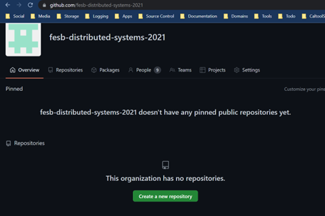

Repository name should follow pattern: `{your-username}-lab-{lab-number}` (ex: `zkalaj-lab-04`) for lab exercises and `{your-username}-hw-{hw-number}` (ex: `zkalaj-hw-04`) for homework assignments.

If the repository is not a part of lab practice: `{your-username}-{project-name}` (ex: `nknezovic-mothers-project`)

Description is optional, **repository must be PRIVATE**, and finally initialize repository by adding README file, adding .gitignore (VisualStudio).

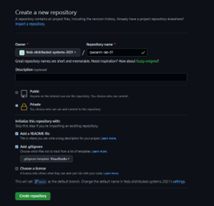

## **Exercise 2: Cloning Remote Git Repository**

To clone remote repository go to created repository on github and press Code > SSH and copy contents.


Open terminal on desired file system location and use command:

`git-clone {your-repository}` (ex: `git-clone git@github.com:fesb-distributed-systems-2021/ipazanin-lab-01.git`)

and now you can open cloned repository with Visual Studio Code using:
`code {your-repository-name}` (ex: `code ipazanin-lab-01`)

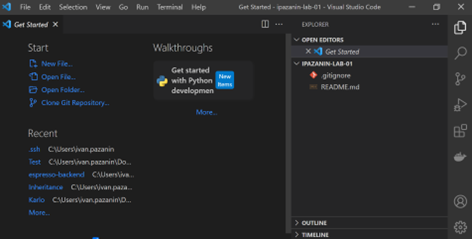

You can learn more about .gitignore file on link <https://git-scm.com/docs/gitignore>

## **Exercise 3: Adding, Committing and Pushing Code to Remote Repository**

If you have previously created a project, you can copy and paste it to the repository folder or you can start creating a new project in the git folder.

To check status of your project, open terminal in repository folder and use commands:

```shell
git status
```


Tells me I have one un-staged file changed (README.md)

Once you are satisfied with your code changes, you must commit them.

The process of permanently "saving" changes is divided into 3 steps:

### **Step 1 - Stage Changes**
   - This step groups selected changes and prepares them for *commiting* i.e. "saving"
   - Staging can be repeated many times

To stage changes, use command:

```shell
git add {file1} {file2} ... {fileN}
```

To *stage* files: *file1, file2, ..., fileN*.

:::info **NOTE**

The staging is not limited to files, you can stage folders also.

:::

Or more concisely:

```shell
git add .
```

To stage all files (`.` means *this* directory i.e. the whole project).


### **Step 2 - Commit All Changes**
   - Commits groups **staged** files into a unit

:::caution **IMPORTANT**

**Commits are the basic unit of change in Git** i.e. you can undo or redo code changes by undoing or redoing specific *commits*.

:::

To commit *staged* changes, use command:

```shell
git commit -m "{your-commit-message}"
```

Where `{your-commit-message}` is a short message describing changes you made to the code in this *commit* e.g.

```shell
git commit -m "Added a new button to print the report as PDF."
```


### **Step 3 - Push Changes to the Remote Repository**
   - Git (specifically `git clone <repo-url>`) works by creating a **copy** of a remote repository located at `<repo-url>` e.g. on GitHub.
   - All changes *stashed* and *commited* are only visible **only** on the copy (called the local repository) of the remote repository.

To apply changes from the local repository (located on the PC) to the remote repository (located on the GitHub) use:

```shell
git push
```


Message notifies we don’t have branch named development on remote repository (GitHub) so we must use to create it:

```shell
git push --set-upstream origin development
```

Now, all chages will be visible on the remote repository on GitHub.


## **Exercise 4: Branching and Merging**

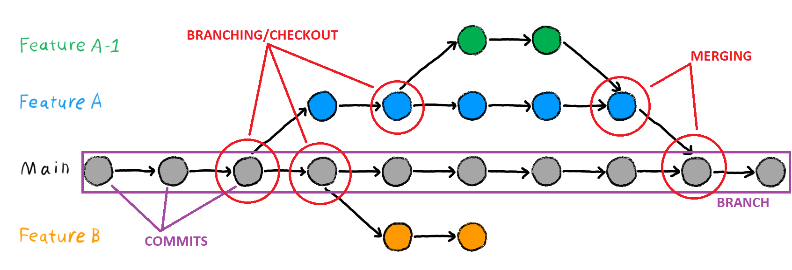

A **branch** is a line of *commits* i.e. a line of changes to the code. A *branch* can point to any *commit* meaning all *commits* from the beginning up to selected *commit* will be applied which means that we can effectively undo changes (*commits*) in code and/or apply changes (*commits*) by changing to which *commit* the *branch* points.

### **Visualize Branches**

To visualize branches, use command:
```shell
gitk --all
```

which opens the following window:
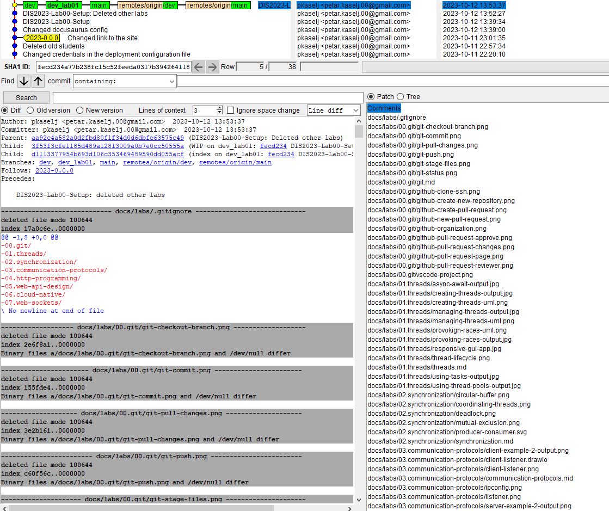

The window contains a lot of information which is divided into 3 sections:
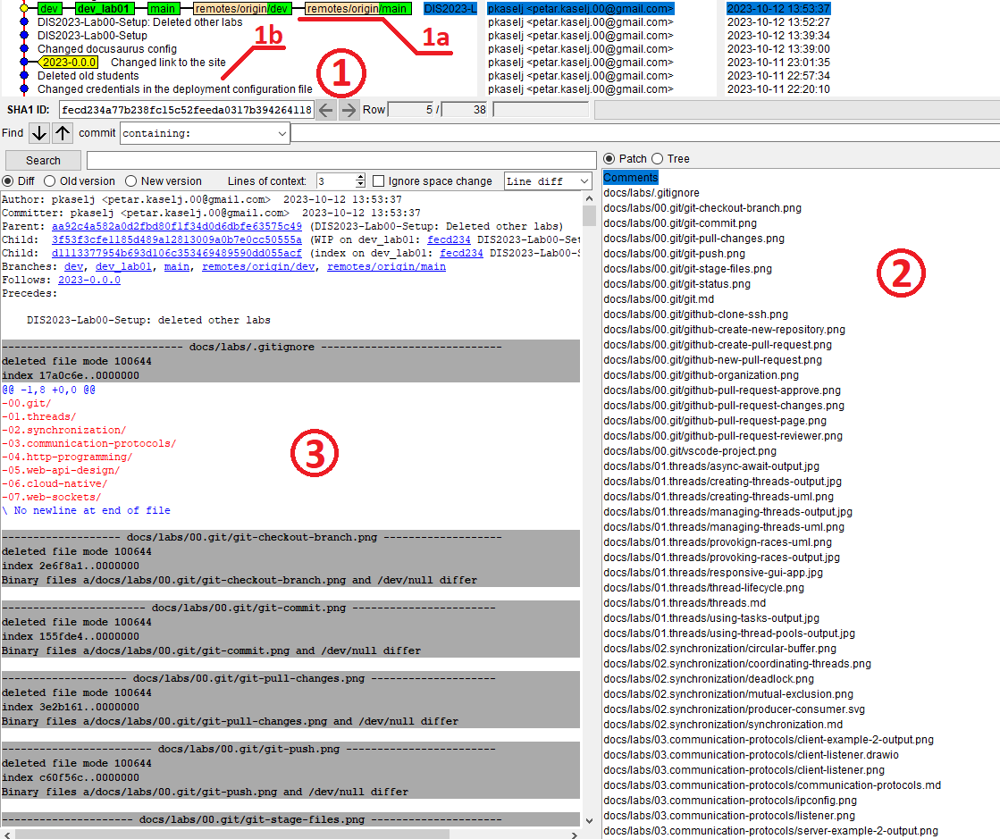

- 1 - Branches and Commits
  - 1a - Green rectangles = commits
  - 1b - A list of commits
- 2 - A list of files changed since the last commit
- 3 - A line-by-line list of changes for the selected file in panel 2

To change the commit to which the branch points, right-click on the target commit and select `Reset <branch> to here` which will effectively revert all the changes made after the selected commit.

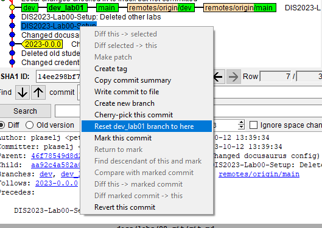

### **Creating a New Branch**

Code development is never done on the main branch (you can checkout to the new branch while having changes).
To create new branch and change git to that branch use:

`git checkout -b {your-branch-name}`
(ex: `git checkout -b development`)

Until you know what you are doing, I recommend doing development on branch `development`.

```shell
git status
```


After making changes on the `development` branch, *stash, commit* and *push* the changes from the `development` branch to the remote repository, as described in  [Exercise 3: Adding, Committing and Pushing Code to Remote Repository](#exercise-3-adding-committing-and-pushing-code-to-remote-repository)


### **Creating Pull Request**

Once you are satisfied with code on your `development` branch, you can create **pull request** (PR) on the `main` branch.

Pull requests will merge changes to the main branch to sync their code.

On GitHub navigate to page Pull request in your repository.


And create new pull request by pressing new pull request.

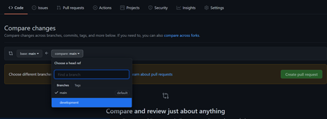

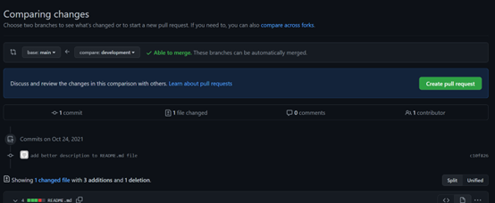

Before you finish creating pull requests, add **pkaselj** as reviewer. (**NOT nknezovic** as in picture below)


**AFTER pkaselj** has approved your pull request, you can merge it using button.

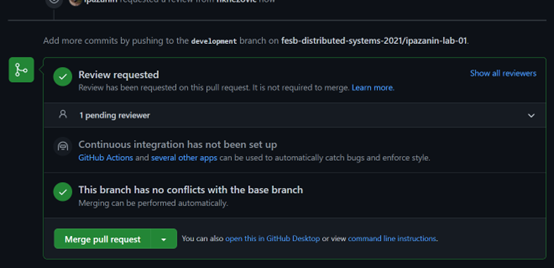

Merge pull request.

To fetch changes on main branch locally, checkout to main branch in your terminal and:

```shell
git checkout main
git pull
git status
```

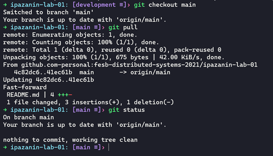

And you will see changes done on development branch now on main branch.

:::tip **NOTES**

When you get a comment on your pull request, you should correct your code accordingly and push a new commit to the remote branch using the same commands as described before.

:::

## **Exercise 5: Tags**

At some point in time, the project i.e. the code is stable. By implementing changes, the project changes - may become unstable, may not work on some platform etc.

We want to mark some *commits* so we can easily find them when we need the code from project from a specific point in time. To mark a commmit we **tag** it in git.

When we want to tag the current commit, we use:
```shell
git tag {tag-name}
```

e.g.

```shell
git tag 2024-0.0.0
```


We can *checkout* *tags* in the same way as we checkout *branches*:

```shell
git checkout 2024-0.0.0
```

:::tip **NOTE**

The general convention i.e. best practice is to name tags in the form of `Maj.Min.Pch`
where:
  - `Maj` - *Version major number* for major changes which break compatibility with older versions
  - `Min` - *Version minor number* for minor changes that (generally) do not break compatibility with older versions
  - `Pch` - *Version patch number* for bug fixes
e.g.
```shell
git tag 2.1.0
```

:::

## References
- [Git Branch Figure](https://the-turing-way.netlify.app/reproducible-research/vcs/vcs-git-branches.html)