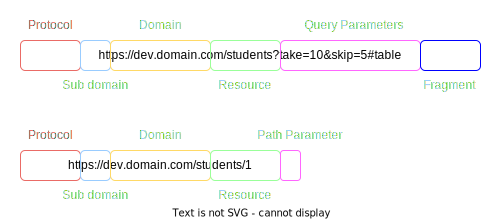

# Lesson
# Lab 5: HTTP Programming

## **Table of Contents**

- [Lesson](#lesson)
- [Lab 5: HTTP Programming](#lab-5-http-programming)
  - [**Table of Contents**](#table-of-contents)
    - [**Objectives**](#objectives)
    - [**Requirements**](#requirements)
  - [**Exercise 1: Manual REST API**](#exercise-1-manual-rest-api)
    - [**HTTP URL**](#http-url)
    - [**HTTP Status Codes**](#http-status-codes)
    - [**HTTP Methods**](#http-methods)

### **Requirements**

- [.NET 8 SDK](https://dotnet.microsoft.com/en-us/download)
- [Postman application](https://www.postman.com/downloads/)

### **Objectives**

In this LAB you will learn about HTTP programming.

**HTTP** is application layer protocol which defines how data is exchanged between server and client.

**HTTP message:**

- A Request-line
- Zero or more header (General|Request|Entity) fields followed by CRLF
- An empty line (i.e., a line with nothing preceding the CRLF) indicating the end of the header fields
- Optionally a message-body

**HTTP** has two messages:

**HTTP Request message:**

```shell
GET /doc/test.html HTTP/1.1
Host: www.test101.com
Connection: keep-alive
Content-Type: text/html
Content-Length: 345

This is message body line 1
This is message body line 2
{
  "name": "Alice",
  "email": "alice@example.com"
}
```

**HTTP Response:**

```shell
HTTP/1.1 200 OK
Date: Sun, 10 Oct 2010 23:26:07 GMT
Server: Apache/2.2.8 (Ubuntu) mod_ssl/2.2.8 OpenSSL/0.9.8g
Last-Modified: Sun, 26 Sep 2010 22:04:35 GMT
ETag: "45b6-834-49130cc1182c0"
Accept-Ranges: bytes
Content-Length: 12
Connection: close
Content-Type: text/html

Hello world!
```

## **Exercise 1: Manual REST API**

Representational state transfer (**REST**) is a software architectural style that describes a
uniform interface between physically separate components,
often across the Internet in a client-server architecture.

**REST** architectural constraints:

- Uniform interface
- Client–server
- Stateless
- Cacheable
- Layered system

### **HTTP URL**

With Hypertext and **HTTP**, **URL** is one of the key concepts of the Web.
It is the mechanism used by browsers to retrieve any published resource on the web.

**URL** stands for Uniform Resource Locator.
A **URL** is nothing more than the address of a given unique resource on the Web.
In theory, each valid URL points to a unique resource.
Such resources can be an HTML page, a CSS document, an image, etc.
In practice, there are some exceptions,
the most common being a **URL** pointing to a resource that no longer exists or that has moved.
As the resource represented by the **URL** and the **URL** itself are handled by the Web server,
it is up to the owner of the web server to carefully manage that resource and its associated **URL**.

Anatomy of **URL**:



### **HTTP Status Codes**

HTTP Status codes give additional information about state of operation,
whether it was completed successfully.

- 1xx informational response – the request was received, continuing process
- 2xx successful – the request was successfully received, understood, and accepted
- 3xx redirection – further action needs to be taken in order to complete the request
- 4xx client error – the request contains bad syntax or cannot be fulfilled
- 5xx server error – the server failed to fulfil an apparently valid request

Common status codes:

| Status Code | Name                  |
| ----------- | --------------------- |
| 200         | Success               |
| 201         | Created               |
| 301         | Permanent Redirect    |
| 302         | Temporary Redirect    |
| 400         | Bad Request           |
| 404         | Not Found             |
| 401         | Unauthorized          |
| 403         | Forbidden             |
| 500         | Internal Server Error |
| 501         | Not Implemented       |

### **HTTP Methods**

| Method | HTTP Method | HTTP Response Status Codes |
| ------ | ----------- | -------------------------- |
| CREATE | POST        | 201, 400, 404, 409, 500    |
| READ   | GET         | 200, 404, 500              |
| UPDATE | PUT         | 200, 204, 400, 404, 500    |
| UPDATE | PATCH       | 200, 204, 400, 404, 500    |
| DELETE | DELETE      | 200, 404, 500              |

Usually HTTP request is unique by criteria

- URL or path
- Method

Dummy rest api for test:
https://restful-api.dev/

There are four main ways to send parameters in an HTTP request, depending on the method (GET, POST, PUT, DELETE) and context:

1. Query Parameters (URL Params)

Where: In the URL, after a ?, joined by &.
Used with: Usually GET, sometimes others.

Example:
```shell
GET /users?name=John&age=25
```
Purpose: For filtering, searching, pagination — i.e. non-sensitive data.
Sent: As part of the URL.

2. Path Parameters

Where: Embedded directly in the URL path.
Used with: GET, PUT, DELETE, etc.

Example:
```shell
GET /users/123
PUT /users/123
```
Purpose: Identifies a specific resource (e.g. user with ID 123).
Sent: As part of the endpoint structure (not in body or query).

3. Request Body Parameters

Where: In the body of the request.
Used with: POST, PUT, PATCH mainly.

Example (as JSON-JavaScript Object Notation):
```shell
POST /users
Content-Type: application/json

{
  "name": "John",
  "age": 25
}
```
Purpose: Sending structured or large data (e.g., form submissions, file uploads).
Sent: In the body, not visible in the URL.

4. Header Parameters

Where: In the HTTP headers.
Used with: Any HTTP method.

Example:
```shell
{
GET /users
Authorization: Bearer abc123
Content-Type: application/json
}
```
Purpose: For metadata, authentication tokens, content type, etc.
Sent: As part of the HTTP header section, separate from the URL and body.

**GET method is used for numbers only! GET method accepts only numbers in the path.  
If you need a parameter that is not a number, you can use the POST method for GET purposes.  
POST method receives a body with parameters.**
