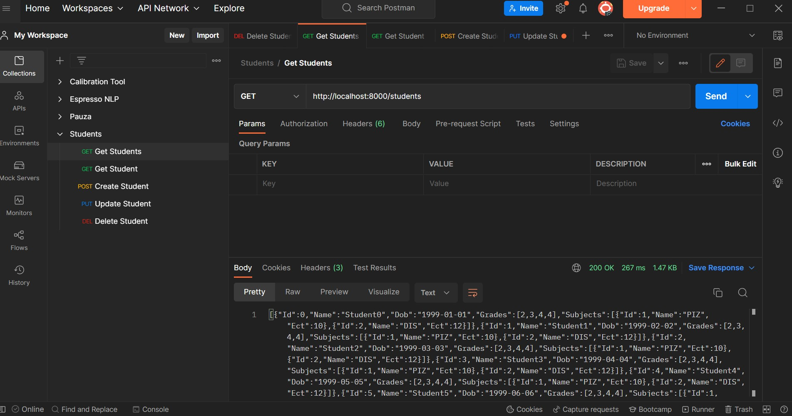

# Lesson
# Lab 5: HTTP Programming

## **Table of Contents**

- [Lesson](#lesson)
- [Lab 5: HTTP Programming](#lab-5-http-programming)
  - [**Table of Contents**](#table-of-contents)
    - [**Objectives**](#objectives)
    - [**Requirements**](#requirements)
  - [**Exercise 1: Manual REST API**](#exercise-1-manual-rest-api)
    - [**HTTP URL**](#http-url)
    - [**HTTP Status Codes**](#http-status-codes)
    - [**HTTP Methods**](#http-methods)
    - [**REST API example**](#rest-api-example)
    - [**Create Solution and Project**](#create-solution-and-project)
    - [**Run the project**](#run-the-project)
  - [**Exercise 2: ASP.NET**](#exercise-2-aspnet)
    - [**ASP .NET**](#asp-net)
    - [**Create Solution and Project**](#create-solution-and-project-1)
    - [**Run the project**](#run-the-project-1)
  - [**Exercise 3: NodeJs with ExpressJs**](#exercise-3-nodejs-with-expressjs)
    - [**Create NodeJs project**](#create-nodejs-project)
    - [**Run the project**](#run-the-project-2)

### **Objectives**

In this LAB you will learn about HTTP programming.

**HTTP** is application layer protocol which defines how data is exchanged between server and client.

**HTTP message:**

- A Request-line
- Zero or more header (General|Request|Entity) fields followed by CRLF
- An empty line (i.e., a line with nothing preceding the CRLF) indicating the end of the header fields
- Optionally a message-body

**HTTP** has two messages:

**HTTP Request message:**

```shell
GET /doc/test.html HTTP/1.1
Host: www.test101.com
Connection: keep-alive
Content-Type: text/html
Content-Length: 345

This is message body line 1
This is message body line 2
```

**HTTP Response:**

```shell
HTTP/1.1 200 OK
Date: Sun, 10 Oct 2010 23:26:07 GMT
Server: Apache/2.2.8 (Ubuntu) mod_ssl/2.2.8 OpenSSL/0.9.8g
Last-Modified: Sun, 26 Sep 2010 22:04:35 GMT
ETag: "45b6-834-49130cc1182c0"
Accept-Ranges: bytes
Content-Length: 12
Connection: close
Content-Type: text/html

Hello world!
```

### **Requirements**

- [.NET 7 SDK](https://dotnet.microsoft.com/en-us/download)
- [Postman application](https://www.postman.com/downloads/)
- [NodeJs](https://nodejs.org/en/)

## **Exercise 1: Manual REST API**

Representational state transfer (**REST**) is a software architectural style that describes a
uniform interface between physically separate components,
often across the Internet in a client-server architecture.

**REST** architectural constraints:

- Uniform interface
- Client–server
- Stateless
- Cacheable
- Layered system

### **HTTP URL**

With Hypertext and **HTTP**, **URL** is one of the key concepts of the Web.
It is the mechanism used by browsers to retrieve any published resource on the web.

**URL** stands for Uniform Resource Locator.
A **URL** is nothing more than the address of a given unique resource on the Web.
In theory, each valid URL points to a unique resource.
Such resources can be an HTML page, a CSS document, an image, etc.
In practice, there are some exceptions,
the most common being a **URL** pointing to a resource that no longer exists or that has moved.
As the resource represented by the **URL** and the **URL** itself are handled by the Web server,
it is up to the owner of the web server to carefully manage that resource and its associated **URL**.

Anatomy of **URL**:


### **HTTP Status Codes**

HTTP Status codes give additional information about state of operation,
whether it was completed successfully.

- 1xx informational response – the request was received, continuing process
- 2xx successful – the request was successfully received, understood, and accepted
- 3xx redirection – further action needs to be taken in order to complete the request
- 4xx client error – the request contains bad syntax or cannot be fulfilled
- 5xx server error – the server failed to fulfil an apparently valid request

Common status codes:

| Status Code | Name                  |
| ----------- | --------------------- |
| 200         | Success               |
| 201         | Created               |
| 301         | Permanent Redirect    |
| 302         | Temporary Redirect    |
| 400         | Bad Request           |
| 404         | Not Found             |
| 401         | Unauthorized          |
| 403         | Forbidden             |
| 404         | Not Found             |
| 500         | Internal Server Error |
| 501         | Not Implemented       |

### **HTTP Methods**

| Method | HTTP Method | HTTP Response Status Codes |
| ------ | ----------- | -------------------------- |
| CREATE | POST        | 201, 400, 404, 409         |
| READ   | GET         | 200, 404                   |
| UPDATE | PUT         | 200, 204, 400, 404         |
| UPDATE | PATCH       | 200, 204, 400, 404         |
| DELETE | DELETE      | 200, 404                   |

Usually HTTP request is unique by criteria

- URL or path
- Method

### **REST API example**

| URL                                           | METHOD | Explanation                     |
| --------------------------------------------- | ------ | ------------------------------- |
| <http://mystudentsapp.com/students>           | GET    | Get All students                |
| <http://mystudentsapp.com/students?name=Mate> | GET    | Get All students with name Mate |
| <http://mystudentsapp.com/students/1>         | GET    | Get student with id 1           |
| <http://mystudentsapp.com/students/>          | POST   | Create student                  |
| <http://mystudentsapp.com/students/1>         | PUT    | Update student with id 1        |
| <http://mystudentsapp.com/students/1>         | DELETE | Delete student with id 1        |

### **Create Solution and Project**

- Create new solution `HttpProgramming`,new console project `HttpProgramming.ManualRestApi` and new class library project `HttpProgramming.Model`

```bash
dotnet new sln --name HttpProgramming
dotnet new console --name HttpProgramming.ManualRestApi
dotnet sln add HttpProgramming.ManualRestApi/HttpProgramming.ManualRestApi.csproj
dotnet new classlib --name HttpProgramming.Model
dotnet sln add HttpProgramming.Model/HttpProgramming.Model.csproj
dotnet add HttpProgramming.ManualRestApi/HttpProgramming.ManualRestApi.csproj reference HttpProgramming.Model/HttpProgramming.Model.csproj
```

- In project `HttpProgramming.Model` add class and file `Subject`:

```csharp
namespace HttpProgramming.Model;

public class Subject
{
    public Subject(int id, string name, int ect)
    {
        Id = id;
        Name = name;
        Ect = ect;
    }

    public int Id { get; }

    public string Name { get; }

    public int Ect { get; }
}
```

- In project `HttpProgramming.Model` add class and file `Student`:

```csharp
namespace HttpProgramming.Model;

public class Student
{
    public Student(
        int id,
        string name,
        DateOnly dob,
        IEnumerable<double> grades,
        IEnumerable<Subject> subjects)
    {
        Id = id;
        Name = name;
        Dob = dob;
        Grades = grades;
        Subjects = subjects;
    }

    public int Id { get; }

    public string Name { get; }

    public DateOnly Dob { get; }

    public IEnumerable<double> Grades { get; }

    public IEnumerable<Subject> Subjects { get; }
}
```

- In project `HttpProgramming.Model` add class and file `StudentsRepository`:

```csharp
namespace HttpProgramming.Model;

public class StudentsRepository
{

    private readonly IEnumerable<Subject> _subjects = new[]
    {
        new Subject(1, "PIZ", 10),
        new Subject(2, "DIS", 12),
    };

    private readonly ICollection<Student> _students;

    public StudentsRepository(int numberOfStudents)
    {
        _students = Enumerable
            .Range(0, numberOfStudents)
            .Select(index => new Student(
                id: index,
                name: $"Student{index}",
                dob: new DateOnly(1999, 1, 1),
                grades: new[] { 2d, 3d, 4d, 4d },
                subjects: _subjects))
            .ToList();
    }

    public IEnumerable<Student> GetAllStudents()
    {
        return _students;
    }

    public Student? GetStudent(int id)
    {
        return _students.FirstOrDefault(student => student.Id == id);
    }

    public void CreateStudent(string name)
    {
        var id = _students.Max(s => s.Id) + 1;

        var student = new Student(
            id: id,
            name: name,
            dob: new DateOnly(1999, 1, 1),
            grades: new[] { 2d, 5d, 3d, 4d },
            subjects: _subjects);

        _students.Add(student);
    }

    public void UpdateStudent(int id, string newName)
    {
        var studentToUpdate = _students.FirstOrDefault(student => student.Id == id);

        if (studentToUpdate is null)
        {
            throw new Exception("Student was not found");
        }

        var updatedStudent = new Student(
            id: studentToUpdate.Id,
            name: newName,
            dob: studentToUpdate.Dob,
            grades: studentToUpdate.Grades,
            subjects: studentToUpdate.Subjects);

        _ = _students.Remove(studentToUpdate);

        _students.Add(updatedStudent);
    }

    public void DeleteStudent(int id)
    {
        var studentToDelete = _students.FirstOrDefault(student => student.Id == id);

        if (studentToDelete is null)
        {
            throw new Exception("Student was not found");
        }

        _ = _students.Remove(studentToDelete);
    }
}

```

- In project `HttpProgramming.ManualRestApi` create new file and class names `ManualRestServer`

```csharp
using System;
using System.IO;
using System.Net;
using System.Text.Json;
using System.Threading.Tasks;
using HttpProgramming.Model;

namespace HttpProgramming.ManualRestApi;

public partial class ManualRestServer
{
    private readonly int _portNumber;
    private readonly StudentsRepository _studentsRepository;

    public ManualRestServer(int portNumber, StudentsRepository studentsRepository)
    {
        _portNumber = portNumber;
        _studentsRepository = studentsRepository;
    }

    public async Task Listen()
    {
        var listener = new HttpListener();
        listener.Prefixes.Add($"http://localhost:{_portNumber}/");

        listener.Start();

        Console.WriteLine("Server is listening...");
        try
        {
            while (true)
            {
                var context = await listener.GetContextAsync();

                Console.WriteLine("Server got request...");

                await HandleRequest(context);
            }
        }
        catch
        {
            listener.Stop();
        }
    }

    private async Task HandleRequest(HttpListenerContext httpListenerContext)
    {
        var request = httpListenerContext.Request;
        var response = httpListenerContext.Response;

        var requestMethod = request.HttpMethod;
        var requestUrl = request.Url?.AbsolutePath ?? string.Empty;
        var requestBody = await GetRequestBody(request);

        var (responseString, responseStatusCode) = GetAppropriateResponseForRequest(
            requestUrl: requestUrl,
            requestMethod: requestMethod,
            requestBody: requestBody);

        var buffer = System.Text.Encoding.UTF8.GetBytes(responseString);

        response.ContentLength64 = buffer.Length;
        response.StatusCode = (int)responseStatusCode;

        var output = response.OutputStream;
        await output.WriteAsync(buffer);

        output.Close();
    }

    private (string responseData, HttpStatusCode) GetAppropriateResponseForRequest(
        string requestUrl,
        string requestMethod,
        string requestBody)
    {
        // TODO: Implement
    }

    private static async Task<string> GetRequestBody(HttpListenerRequest request)
    {
        if (!request.HasEntityBody)
            return string.Empty;

        var body = request.InputStream;
        var encoding = request.ContentEncoding;
        var reader = new StreamReader(body, encoding);

        var requestBodyString = await reader.ReadToEndAsync();

        return requestBodyString;
    }

    private static int? GetStudentIdFromInputUrl(string requestUrl)
    {
        var splittedString = requestUrl.Split("/");
        return splittedString.Length != 3 ? null : int.TryParse(splittedString[2], out var studentId) ? studentId : null;
    }
}
```

- In class `ManualRestServer` implement method `GetAppropriateResponseForRequest`:

Method `GetAppropriateResponseForRequest` should handle following requests

| URL                                | METHOD | Explanation                                                  |
| ---------------------------------- | ------ | ------------------------------------------------------------ |
| <http://localhost:8000/students>   | GET    | Get All students                                             |
| <http://localhost:8000/students/1> | GET    | Get student with id 1, if not found return not found status  |
| <http://localhost:8000/students>   | POST   | Create student, if body is empty return bad request          |
| <http://localhost:8000/students/1> | PUT    | Update student with id 1, handle if not found and empty body |
| <http://localhost:8000/students/1> | DELETE | Delete student with id 1, handle not found                   |

Following is proposed implementation for **GET** requests:

```csharp
        try
        {
            switch (requestMethod)
            {
                case "GET":
                    if (requestUrl == "/students")
                    {
                        var students = _studentsRepository.GetAllStudents();

                        var responseData = JsonSerializer.Serialize(students);

                        return (responseData, HttpStatusCode.OK);
                    }

                    if(!requestUrl.StartsWith("/students/"))
                    {
                        return ("Not Found", HttpStatusCode.NotFound);
                    }

                    var getStudentId = GetStudentIdFromInputUrl(requestUrl);
                    if (!getStudentId.HasValue)
                    {
                        return ("Not Implemented", HttpStatusCode.NotImplemented);
                    }

                    var student = _studentsRepository.GetStudent(getStudentId.Value);

                    if (student is null)
                    {
                        return ("Not Found", HttpStatusCode.NotFound);
                    }

                    var studentString = JsonSerializer.Serialize(student);

                    return (studentString, HttpStatusCode.OK);
                
                default:
                    return ("Not Implemented", HttpStatusCode.NotImplemented);
            }
        }
        catch (Exception e)
        {
            return (e.Message, HttpStatusCode.InternalServerError);
        }
```

### **Run the project**

- Run the project:

```bash
dotnet run --project HttpProgramming.ManualRestApi/HttpProgramming.ManualRestApi.csproj
```

- Test the project using Postman application to send requests



## **Exercise 2: ASP.NET**

As you can see from previous exercise creating engine to parse urls and methods is not easy even for simple cases.
And since all of that can be made generic, microsoft has made web server framework to handle all of hard work for us.

### **ASP .NET**

In **ASP.NET** applications it is common practice to utilize Inversion of Control (IoC) Container.
IoC container or in some references Dependency Injection (DI) is a pattern used commonly through many business applications
to inject necessary dependencies (usually services) into classes requiring these dependencies.

**ASP.NET** framework provides developer with build in DI container in which developer can define custom services with one of three lifetime scopes:

- **Singleton:** lifetime of service is through lifetime of application
- **Scoped:** lifetime of service is scope of one request, so for each request new service will be created
- **Transient:** each time service is requested, new instance is created

### **Create Solution and Project**

- Create new webapi project `HttpProgramming.WebApi`

```bash
dotnet new webapi --name HttpProgramming.WebApi
dotnet sln add HttpProgramming.WebApi/HttpProgramming.WebApi.csproj
dotnet add HttpProgramming.WebApi/HttpProgramming.WebApi.csproj reference HttpProgramming.Model/HttpProgramming.Model.csproj
```

- In project `HttpProgramming.WebApi` delete files `WeatherForecastController` and `WeatherForecast`:

- Modify file `Program` to look as following:

```csharp
using HttpProgramming.Model;

var builder = WebApplication.CreateBuilder(args);

builder.Services.AddControllers();
builder.Services.AddEndpointsApiExplorer();
builder.Services.AddSwaggerGen();

// Register StudentsRepository as singleton in DI container
builder.Services.AddSingleton(_ => new StudentsRepository(1000));

var app = builder.Build();

if (app.Environment.IsDevelopment())
{
    _ = app.UseSwagger();
    _ = app.UseSwaggerUI();
}

app.MapControllers();

app.Run();
```

- In project `HttpProgramming.WebApi` in folder `Controllers` add new file and class `StudentsController`:

```csharp
using HttpProgramming.Model;
using Microsoft.AspNetCore.Mvc;

namespace HttpProgramming.WebApi.Controllers;

[ApiController]
public class StudentsController : ControllerBase
{
    private readonly StudentsRepository _studentsRepository;

    public StudentsController(StudentsRepository studentsRepository)
    {
        _studentsRepository = studentsRepository;
    }

    [HttpGet]
    [Route("/students")]
    public async Task<IActionResult> GetStudents()
    {
        return Ok(_studentsRepository.GetAllStudents());
    }

    [HttpGet]
    [Route("/students/{studentId}")]
    public IActionResult GetStudent(
        [FromRoute] int studentId)
    {
        var student = _studentsRepository.GetStudent(studentId);

        return student is null ? NotFound() : Ok(student);
    }    
}
```

- In class `StudentsController` implement method `CreateStudent` which will create student
- In class `StudentsController` implement method `UpdateStudent` which will update student with specified id
- In class `StudentsController` implement method `DeleteStudent` which will delete student with specified id

### **Run the project**

- Run the project:

```bash
dotnet run --project HttpProgramming.WebApi/HttpProgramming.WebApi.csproj
```

- Test the project using Postman application to send requests

## **Exercise 3: NodeJs with ExpressJs**

In this exercise you will create web api using **javascript** language.
**NodeJs** is used as runtime and **ExpressJs** is **REST/HTTP** framework.

### **Create NodeJs project**

- Create folder and initialize nodejs project

```bash
mkdir nodeapi
cd nodeapi
npm init -y
```

- Install ExpressJs

```bash
npm install express
```

- Create new file named `index.js` in `nodeapi` folder and add following contents to it:

```js
express = require("express");
const app = express();
const port = 8000;

const students = Array(100)
  .fill(0)
  .map((_, index) => ({
    id: index,
    name: `Student${index}`,
    dob: Date.now(),
    grades: [2.3, 4, 5, 4.4],
    subjects: [
      {
        name: "PIZ",
        ects: 11,
      },
      {
        name: "DIS",
        ects: 10,
      },
    ],
  }));

app.get("/students", (req, res) => {
  res.send(students);
});

app.get("/students/:studentId", (req, res) => {
  const student = students.find(
    (student) => student.id == req.params.studentId
  );

  console.log(req.params.studentId);
  if (!student) {
    res.sendStatus(404);
    return;
  }

  res.send(student);
});

app.listen(port, () => {
  console.log(`Example app listening on port ${port}`);
});
```

- In file `index.js` implement listener callback which will create student
- In file `index.js` implement listener callback which will update student with specified id
- In file `index.js` implement listener callback which will delete student with specified id

### **Run the project**

- Run the project:

```bash
node index.js
```

- Test the project using Postman application to send requests
