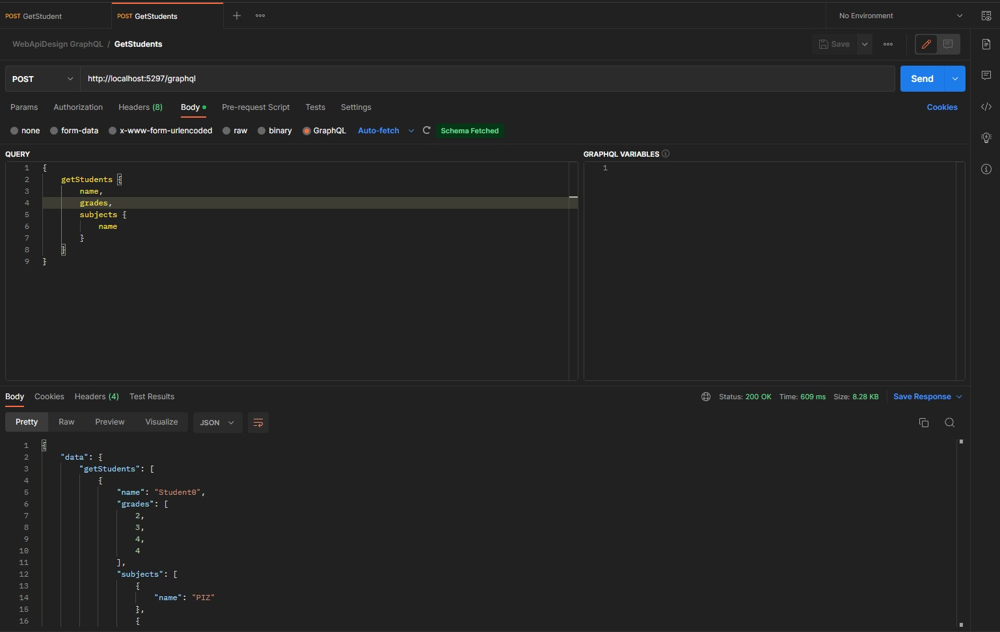
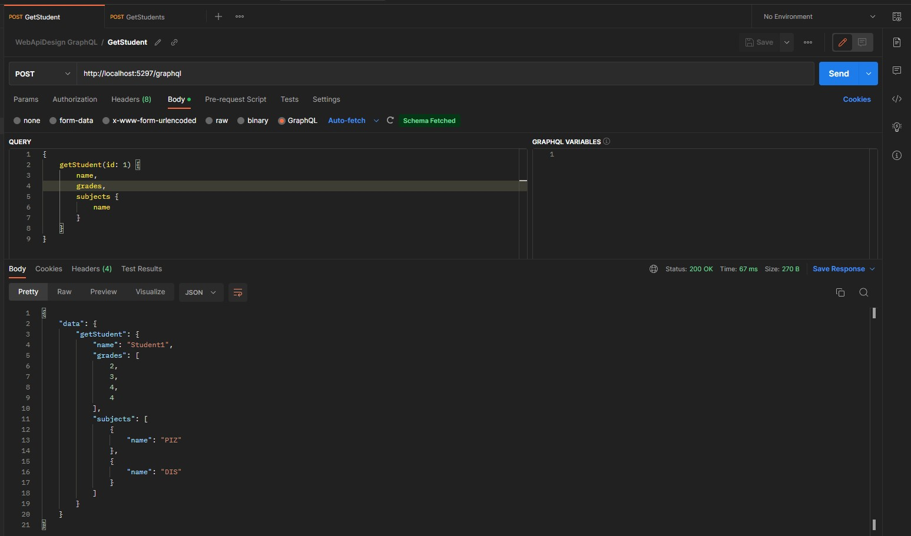
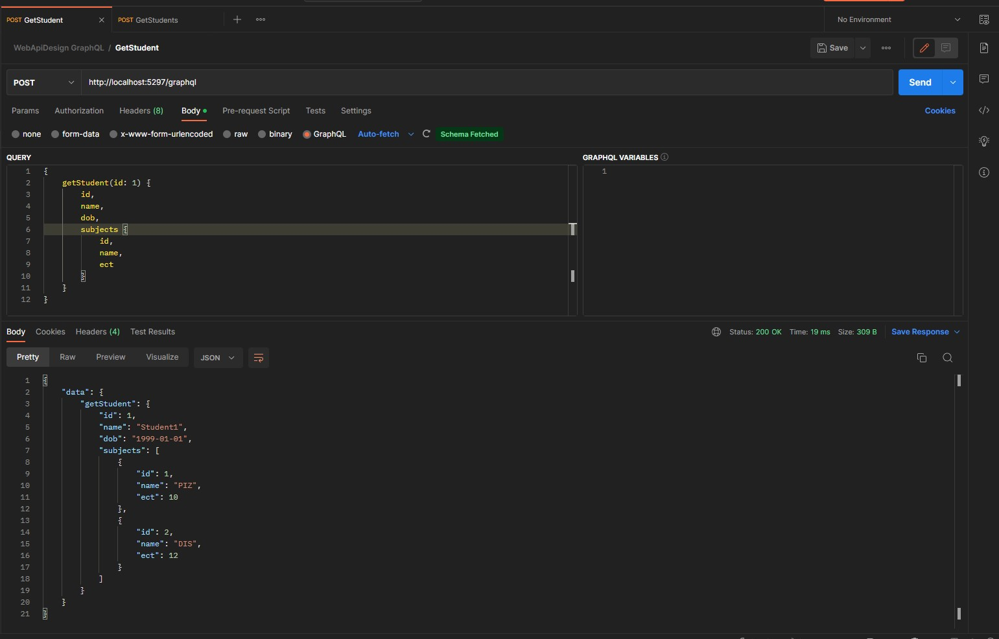
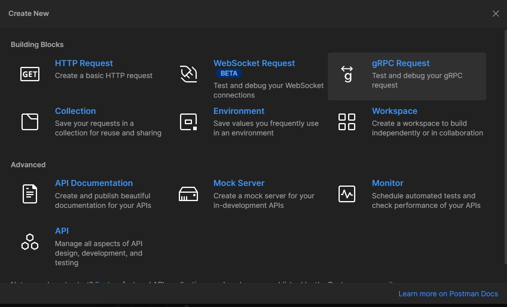
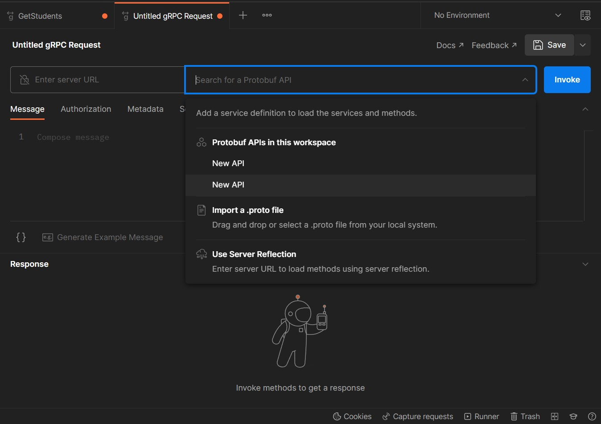
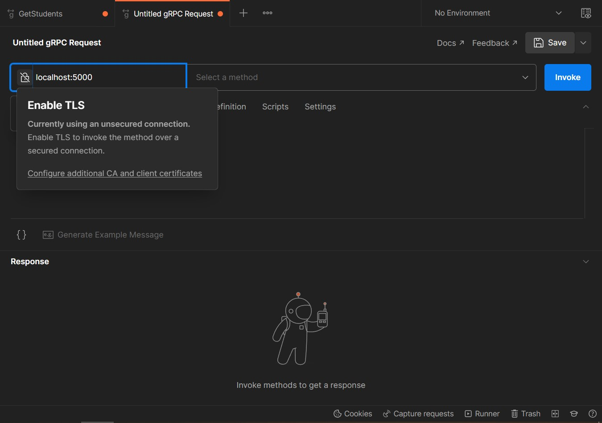
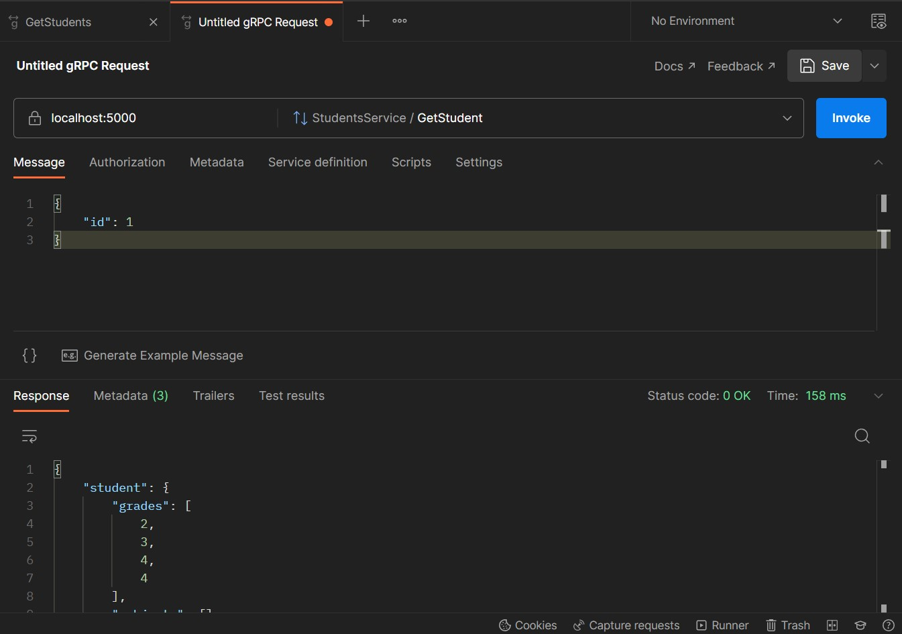

# Lesson
# Lab 6: Web API Design

## **Table of Contents**

- [Lesson](#lesson)
- [Lab 6: Web API Design](#lab-6-web-api-design)
  - [**Table of Contents**](#table-of-contents)
    - [**Requirements**](#requirements)
    - [**Objectives**](#objectives)
    - [**Web API**](#web-api)
    - [**SOA**](#soa)
  - [**Exercise 1: GraphQL Queries**](#exercise-1-graphql-queries)
    - [**Create Solution and Project**](#create-solution-and-project)
    - [**Run and test project**](#run-and-test-project)
  - [**Exercise 2: GraphQL Mutations**](#exercise-2-graphql-mutations)
    - [**Run and test project**](#run-and-test-project-1)
  - [**Exercise 3: gRPC Queries**](#exercise-3-grpc-queries)
    - [**Protocol Buffers**](#protocol-buffers)
    - [**Create Project**](#create-project)
    - [**Run and test project**](#run-and-test-project-2)
  - [**Exercise 4: gRPC Commands**](#exercise-4-grpc-commands)
    - [**Run and test project**](#run-and-test-project-3)

### **Requirements**

- [.NET 7 SDK](https://dotnet.microsoft.com/en-us/download)
- [Postman application](https://www.postman.com/downloads/)

### **Objectives**

In this LAB you will learn about different web api designs and how to implement them.

### **Web API**

A **Web API** is an application programming interface for either a web server or a web browser.
It is a web development concept, usually limited to a web application's client-side (including any web frameworks being used),
and thus usually does not include web server or browser implementation details such as SAPIs or APIs unless publicly accessible by a remote web application.

### **SOA**

**SOA** or Service-Oriented Architecture is a style of software design in
to which defined services provide service to other application components over the network protocol.
**SOA** is technology, product and platform independent.

According to the definition of service-oriented architecture, a service is defined by the following properties:

- describes business logic with a specific outcome
- the service is self-contained
- the logic is isolated from the consumer, the consumer does not need to know the implementation details
- may include other services.

Common views on SOA architecture are:

- **REST**
- **GraphQL**
- **gRPC**
- **SOAP**
- **WCF**

**REST** architecture is most commonly used and easiest to implement because all modern web server frameworks support it by default.

We have worked on REST in past labs and in this lab we will focus on **GraphQL** abd **gRPC**.

## **Exercise 1: GraphQL Queries**

**GraphQL** is an open source language for data processing and manipulation.
**GraphQL** allows clients to define the structure of the data returned by the server,
and thus prevents large amounts of unnecessary data from being transferred,
however this reduces effectiveness save query cache.

GraphQL consists of:

- data types
- query language (SDL)
- execution semantics
- static validations
- introspection of data types.

Supported operations are:

- reading
- writing
- subscription via web hook.

**GraphQL** has two main approaches:

- Schema First Approach
    - The Schema first approach relies upon the GraphQL schema language, coding conventions, and tries to provide a minimal amount of syntax.
    - It is the easiest to get started though it does not currently support some advanced scenarios.
- Graph Type Approach
    - The GraphType first approach can be more verbose, but gives you access to all of the provided properties of your GraphType's and Schema.
    - You are required to use inheritance to leverage that functionality.

In this exercise you will use Graph Type Spproach.

### **Create Solution and Project**

- Create new solution `WebApiDesign`, new webapi project `WebApiDesign.GraphQlApi` and new class library project `WebApiDesign.Model`

```sh
dotnet new sln --name WebApiDesign
dotnet new classlib --name WebApiDesign.Model
dotnet new webapi --name WebApiDesign.GraphQlApi
```

Add Projects to solution and add reference to project `WebApiDesign.Model` in project `WebApiDesign.GraphQlApi`

```sh
dotnet sln add WebApiDesign.Model/WebApiDesign.Model.csproj
dotnet sln add WebApiDesign.GraphQlApi/WebApiDesign.GraphQlApi.csproj
dotnet add WebApiDesign.GraphQlApi/WebApiDesign.GraphQlApi.csproj reference WebApiDesign.Model/WebApiDesign.Model.csproj
```

Add GraphQL packages to `WebApiDesign.GraphQlApi` project:

```sh
dotnet add WebApiDesign.GraphQlApi/WebApiDesign.GraphQlApi.csproj package GraphQL
dotnet add WebApiDesign.GraphQlApi/WebApiDesign.GraphQlApi.csproj package GraphQL.SystemTextJson
dotnet add WebApiDesign.GraphQlApi/WebApiDesign.GraphQlApi.csproj package GraphQL.MicrosoftDI
dotnet add WebApiDesign.GraphQlApi/WebApiDesign.GraphQlApi.csproj package GraphQL.Server.Transports.AspNetCore
```

- In project `WebApiDesign.Model` add class and file `Subject`:

```csharp
namespace WebApiDesign.Model;

public class Subject
{
    public Subject(int id, string name, int ect)
    {
        Id = id;
        Name = name;
        Ect = ect;
    }

    public int Id { get; }

    public string Name { get; }

    public int Ect { get; }
}
```

- In project `WebApiDesign.Model` add class and file `Student`:

```csharp
namespace WebApiDesign.Model;

public class Student
{
    public Student(
        int id,
        string name,
        DateOnly dob,
        IEnumerable<double> grades,
        IEnumerable<Subject> subjects)
    {
        Id = id;
        Name = name;
        Dob = dob;
        Grades = grades;
        Subjects = subjects;
    }

    public int Id { get; }

    public string Name { get; }

    public DateOnly Dob { get; }

    public IEnumerable<double> Grades { get; }

    public IEnumerable<Subject> Subjects { get; }
}
```

- In project `WebApiDesign.Model` add class and file `StudentsRepository`:

```csharp
namespace WebApiDesign.Model;

public class StudentsRepository
{

    private readonly IEnumerable<Subject> _subjects = new[]
    {
        new Subject(1, "PIZ", 10),
        new Subject(2, "DIS", 12),
    };

    private readonly ICollection<Student> _students;

    public StudentsRepository(int numberOfStudents)
    {
        _students = Enumerable
            .Range(0, numberOfStudents)
            .Select(index => new Student(
                id: index,
                name: $"Student{index}",
                dob: new DateOnly(1999, 1, 1),
                grades: new[] { 2d, 3d, 4d, 4d },
                subjects: _subjects))
            .ToList();
    }

    public IEnumerable<Student> GetAllStudents()
    {
        return _students;
    }

    public Student? GetStudent(int id)
    {
        return _students.FirstOrDefault(student => student.Id == id);
    }

    public void CreateStudent(string name)
    {
        var id = _students.Max(s => s.Id) + 1;

        var student = new Student(
            id: id,
            name: name,
            dob: new DateOnly(1999, 1, 1),
            grades: new[] { 2d, 5d, 3d, 4d },
            subjects: _subjects);

        _students.Add(student);
    }

    public void UpdateStudent(int id, string newName)
    {
        var studentToUpdate = _students.FirstOrDefault(student => student.Id == id);

        if (studentToUpdate is null)
        {
            throw new Exception("Student was not found");
        }

        var updatedStudent = new Student(
            id: studentToUpdate.Id,
            name: newName,
            dob: studentToUpdate.Dob,
            grades: studentToUpdate.Grades,
            subjects: studentToUpdate.Subjects);

        _ = _students.Remove(studentToUpdate);

        _students.Add(updatedStudent);
    }

    public void DeleteStudent(int id)
    {
        var studentToDelete = _students.FirstOrDefault(student => student.Id == id);

        if (studentToDelete is null)
        {
            throw new Exception("Student was not found");
        }

        _ = _students.Remove(studentToDelete);
    }
}

```

- In project `WebApiDesign.GraphQlApi` create folder `GraphQlTypes`

- In folder `GraphQlTypes` create file `SubjectType.cs` with following contents:

```csharp
using GraphQL.Types;
using WebApiDesign.Model;

namespace WebApiDesign.GraphQlApi.GraphQlTypes;

public class SubjectType : ObjectGraphType<Subject>
{

    public SubjectType()
    {
        Name = nameof(Subject);
        _ = Field(s => s.Id);
        _ = Field(s => s.Name, nullable: false);
        _ = Field(s => s.Ect);
    }
}
```

- In folder `GraphQlTypes` create file `StudentType.cs` with following contents:

```csharp
using GraphQL.Types;
using WebApiDesign.Model;

namespace WebApiDesign.GraphQlApi.GraphQlTypes;

public class StudentType : ObjectGraphType<Student>
{
    public StudentType()
    {
        Name = nameof(Student);
        _ = Field(s => s.Id);
        _ = Field(s => s.Name, nullable: false);
        _ = Field(s => s.Dob);
        _ = Field(s => s.Grades, nullable: false);
        _ = Field<ListGraphType<SubjectType>>(nameof(Student.Subjects));
    }
}
```

- In folder `GraphQlTypes` create file `StudentQuery.cs` with following contents:

```csharp
using GraphQL;
using GraphQL.Types;
using WebApiDesign.Model;

namespace WebApiDesign.GraphQlApi.GraphQlTypes;

public class StudentQuery : ObjectGraphType
{
    public StudentQuery(StudentsRepository studentsRepository)
    {
        Name = nameof(StudentQuery);
        _ = Field<ListGraphType<StudentType>>("getStudents")
            .Resolve(_ =>
            {
                return studentsRepository.GetAllStudents();
            });

        _ = Field<StudentType>("getStudent")
            .Argument<IntGraphType>("id")
            .Resolve(resolveFieldContext =>
            {
                var studentId = resolveFieldContext.GetArgument<int>("id");

                return studentsRepository.GetStudent(studentId);
            });
    }
}
```

- In folder `GraphQlTypes` create file `StudentMutations.cs` with following contents:

```csharp
using GraphQL;
using GraphQL.Types;
using WebApiDesign.Model;

namespace WebApiDesign.GraphQlApi.GraphQlTypes;

public class StudentMutation : ObjectGraphType
{
    public StudentMutation(StudentsRepository studentsRepository)
    {
        // TODO: Implement
    }
}
```

- In folder `GraphQlTypes` create file `WebApiDesignSchema.cs` with following contents:

```csharp
using GraphQL.Types;

namespace WebApiDesign.GraphQlApi.GraphQlTypes;

public class WebApiDesignSchema : Schema
{

    public WebApiDesignSchema(IServiceProvider serviceProvider) : base(serviceProvider)
    {
        Query = serviceProvider.GetRequiredService<StudentQuery>();
        //Mutation = serviceProvider.GetRequiredService<StudentMutation>();
    }
}
```

- In project `WebApiDesign.GraphQlApi` delete folder `Controllers` and file `WeatherForecast.cs`:

- Modify file `Program` to look as following:

```csharp
using GraphQL;
using GraphQL.MicrosoftDI;
using GraphQL.Types;
using WebApiDesign.GraphQlApi.GraphQlTypes;
using WebApiDesign.Model;

var builder = WebApplication.CreateBuilder(args);

builder.Services.AddSingleton(_ => new StudentsRepository(100));
builder.Services.AddGraphQL(builder =>
{
    builder.AddSystemTextJson()
        .AddErrorInfoProvider(errorInfoProvider =>
        {
#if DEBUG
            errorInfoProvider.ExposeData = true;
            errorInfoProvider.ExposeExceptionDetails = true;
            errorInfoProvider.ExposeExceptionDetails = true;
            errorInfoProvider.ExposeExceptionDetailsMode = GraphQL.Execution.ExposeExceptionDetailsMode.Message;
#endif
        })
        .AddSchema<WebApiDesignSchema>();
});
builder.Services.AddSingleton<ISchema, WebApiDesignSchema>(servicesProvider => new WebApiDesignSchema(new SelfActivatingServiceProvider(servicesProvider)));

var app = builder.Build();

app.UseGraphQL<ISchema>();

app.Run();
```

### **Run and test project**

- Using postman application test query `getStudents`:



- Using postman application test query `getStudent`:



- In query `getStudent` edit GraphQL request body to look like this

```graphql
{ 
    getStudent(id: 1) {
        id,
        name,
        dob,
        subjects {
            id,
            name,
            ect
        }
    }
}
```

- Observe changes after executing request again:



## **Exercise 2: GraphQL Mutations**

- In folder `GraphQlTypes` modify file `WebApiDesignSchema.cs` with following contents:

```csharp
using GraphQL.Types;

namespace WebApiDesign.GraphQlApi.GraphQlTypes;

public class WebApiDesignSchema : Schema
{

    public WebApiDesignSchema(IServiceProvider serviceProvider) : base(serviceProvider)
    {
        Query = serviceProvider.GetRequiredService<StudentQuery>();
        Mutation = serviceProvider.GetRequiredService<StudentMutation>();
    }
}
```

- In project `WebApiDesign.GraphQlApi` in folder `GraphQlTypes` implement class `StudentMutation`:

```csharp
using GraphQL;
using GraphQL.Types;
using WebApiDesign.Model;

namespace WebApiDesign.GraphQlApi.GraphQlTypes;

public class StudentMutation : ObjectGraphType
{
    public StudentMutation(StudentsRepository studentsRepository)
    {
        // TODO: Implement
    }
}
```

- Add field `createStudent` which creates new student using `studentsRepository`
    - It receives non nullable string argument `name`
    - It returns created student

- Add field `updateStudent` which updates student using `studentsRepository`
    - It receives int argument `id`
    - It receives non nullable string argument `name`
    - It returns updated student

- Add field `deleteStudent` which deletes student using `studentsRepository`
    - It receives int argument `id`
    - It returns deleted student

### **Run and test project**

Run and test project using Postman application.

## **Exercise 3: gRPC Queries**

**gRPC** is a modern open source high performance Remote Procedure Call (RPC) framework that can run in any environment.
It can efficiently connect services in and across data centers with pluggable support for load balancing, tracing, health checking and authentication.
It is also applicable in last mile of distributed computing to connect devices, mobile applications and browsers to backend services.

### **Protocol Buffers**

**gRPC** can use protocol buffers as both its Interface Definition Language (IDL) and as its underlying message interchange format.
In gRPC, a client application can directly call a method on a server application on a different machine as if it were a local object (**Proxy Pattern**),
making it easier for you to create distributed applications and services.
As in many **RPC** systems, **gRPC** is based around the idea of defining a service,
specifying the methods that can be called remotely with their parameters and return types.
On the server side, the server implements this interface and runs a gRPC server to handle client calls.
On the client side, the client has a stub (referred to as just a client in some languages) that provides the same methods as the server.

Example of simple **protobuf** (Protocol Buffers) definition:

```protobuf
// The greeter service definition.
service Greeter {
  // Sends a greeting
  rpc SayHello (HelloRequest) returns (HelloReply) {}
}

// The request message containing the user's name.
message HelloRequest {
  string name = 1;
}

// The response message containing the greetings
message HelloReply {
  string message = 1;
}
```

This message defines request `SayHello` on `Greeter` service
which receives object of type `HelloRequest` containing field `name`
and returns object of type `HelloReply` containing field `message`.

This definition is language agnostic meaning any language can implement it, both client and server side.

### **Create Project**

- Create new webapi project `WebApiDesign.GrpcApi` and add it to solution `WebApiDesign`.

```sh
dotnet new webapi --name WebApiDesign.GrpcApi
dotnet sln add WebApiDesign.GrpcApi/WebApiDesign.GrpcApi.csproj
```

Add reference to project `WebApiDesign.Model` in project `WebApiDesign.GrpcApi`

```sh
dotnet add WebApiDesign.GrpcApi/WebApiDesign.GrpcApi.csproj reference WebApiDesign.Model/WebApiDesign.Model.csproj
```

Add **gRPC** packages to `WebApiDesign.GrpcApi` project:

```sh
dotnet add WebApiDesign.GrpcApi/WebApiDesign.GrpcApi.csproj package Grpc.AspNetCore
```

- In project `WebApiDesign.GrpcApi` delete folder `Controllers` and file `WeatherForecast.cs`:
- Modify file `Program` to look as following:

```csharp
using WebApiDesign.GrpcApi.Apis;
using WebApiDesign.Model;

var builder = WebApplication.CreateBuilder(args);
builder.Services.AddGrpc();
builder.Services.AddSingleton(_ => new StudentsRepository(10));

var app = builder.Build();

app.UseRouting();
app.MapGrpcService<StudentsApi>();

app.Run();
```

- In project `WebApiDesign.GrpcApi` add new folder `Protos`
- In folder `Protos` create file `students.proto` with following contents:

```protobuf
syntax = "proto3";

service StudentsService {
  rpc GetStudents (GetStudentsRequest) returns (GetStudentsResponse);
  
  rpc GetStudent (GetStudentRequest) returns (GetStudentResponse);
}

message SubjectType {
    int32 id = 1;
    string name = 2;
    int32 ect = 3;
}

message DateOnlyType {
    int32 year = 1;
    int32 month = 2;
    int32 day = 3;
}

message StudentType {
    int32 id = 1;
    string name = 2;
    DateOnlyType dob = 3;
    repeated double grades = 4;
    repeated SubjectType subjects = 5;
}

message GetStudentsRequest { }

message GetStudentsResponse {
    repeated StudentType students = 1;
}

message GetStudentRequest { 
    int32 id = 1;
}

message GetStudentResponse {
    StudentType student = 1;
}
```

- Include proto file in `WebApiDesign.GrpcApi.csproj`:

```xml
  <ItemGroup>
    <Protobuf Include="Protos\students.proto" />
  </ItemGroup>
```

- Create new file `StudentsApi.cs` in folder `Apis` and add following implementation:

```csharp
using Grpc.Core;
using WebApiDesign.Model;

namespace WebApiDesign.GrpcApi.Apis;

public class StudentsApi : StudentsService.StudentsServiceBase
{
    private readonly StudentsRepository _studentsRepository;

    public StudentsApi(StudentsRepository studentsRepository)
    {
        _studentsRepository = studentsRepository;
    }

    public override Task<GetStudentsResponse> GetStudents(GetStudentsRequest request, ServerCallContext context)
    {
        var students = _studentsRepository
            .GetAllStudents()
            .Select(MapStudentToStudentType);

        var response = new GetStudentsResponse();
        response.Students.AddRange(students);

        return Task.FromResult(response);
    }

    public override Task<GetStudentResponse> GetStudent(GetStudentRequest request, ServerCallContext context)
    {
        var student = _studentsRepository.GetStudent(request.Id);

        if (student is null)
        {
            var status = new Status(StatusCode.NotFound, "Student was not found");
            throw new RpcException(status, "Student was not found");
        }

        var response = new GetStudentResponse
        {
            Student = MapStudentToStudentType(student),
        };

        return Task.FromResult(response);
    }

    private StudentType MapStudentToStudentType(Student student)
    {
        var studentType = new StudentType
        {
            Id = student.Id,
            Name = student.Name,
            Dob = new DateOnlyType
            {
                Year = student.Dob.Year,
                Month = student.Dob.Month,
                Day = student.Dob.Day,
            },
        };

        studentType.Grades.AddRange(student.Grades);

        var subjects = studentType.Subjects.Select(subject => new SubjectType
        {
            Id = subject.Id,
            Name = subject.Name,
            Ect = subject.Ect,
        });
        studentType.Subjects.AddRange(subjects);

        return studentType;
    }
}
```

### **Run and test project**

- In Postman application create new gRPC request:



- In request import protofile definitions:



- Set server URL (**https port**) and enable TLS:



- Select method you want to test and write appropriate message:



## **Exercise 4: gRPC Commands**

- In `Protos/students.proto` file define methods on `StudentsService`:
    - CreateStudent
        - Which receives message containing students name
        - Validates that name is not empty and returns appropriate response
        - Creates student using `StudentRepository`
        - Returns empty message
    - UpdateStudent
        - Which receives message containing students name and id
        - Validates  that name is not empty name and returns appropriate response
        - Updates student using `StudentRepository`
        - Returns empty message
    - DeleteStudent
        - Which receives message containing students id
        - Deletes student using `StudentRepository`
        - Returns empty message

- In file `StudentApi` override newly added methods and implement them accordingly

### **Run and test project**

- In Postman application create new gRPC requests for added methods and test them.
