# Lesson
# Lab 7: Cloud Native

## **Table of Contents**

- [Lesson](#lesson)
- [Lab 7: Cloud Native](#lab-7-cloud-native)
  - [**Table of Contents**](#table-of-contents)
    - [**Requirements**](#requirements)
    - [**Objectives**](#objectives)
    - [**Cloud Native**](#cloud-native)
  - [**Exercise 1: Creating Containers**](#exercise-1-creating-containers)
    - [**Cloud Containers**](#cloud-containers)
    - [**Create Solution and Project**](#create-solution-and-project)
    - [**Run and test container**](#run-and-test-container)
    - [**Clean Resources**](#clean-resources)
  - [**Exercise 2: Cloud Providers**](#exercise-2-cloud-providers)
    - [Publishing image to container registry](#publishing-image-to-container-registry)
    - [Creating Azure Student Account](#creating-azure-student-account)
    - [Creating Azure Container Instance](#creating-azure-container-instance)

### **Requirements**

- [.NET 7 SDK](https://dotnet.microsoft.com/en-us/download)
- [Docker Desktop](https://www.docker.com/products/docker-desktop)

### **Objectives**

In this LAB you will learn about creating and deploying cloud native applications.

### **Cloud Native**

**Cloud native** computing is an approach in software development that utilizes cloud computing to
"build and run scalable applications in modern, dynamic environments such as public, private, and hybrid clouds".
These technologies such as **containers**, microservices, serverless functions, cloud native processors and immutable infrastructure,
deployed via declarative code are common elements of this architectural style.

## **Exercise 1: Creating Containers**

### **Cloud Containers**

A **container** is a standard unit of software that packages up code and all its dependencies so the application runs quickly
and reliably from one computing environment to another.
A Docker container image is a lightweight, standalone, executable package of software that includes everything needed to run an application:

- code
- runtime
- system tools
- system libraries
- settings

### **Create Solution and Project**

- Create new solution `CloudNative` and new webapi project `CloudNative.ContainerizedWebApi`

```sh
dotnet new sln --name CloudNative
dotnet new webapi --name CloudNative.ContainerizedWebApi
```

- Add Project to solution

```sh
dotnet sln add CloudNative.ContainerizedWebApi/CloudNative.ContainerizedWebApi.csproj
```

- In project `CloudNative.ContainerizedWebApi` edit `Program.cs` to have following contents:

```csharp
var builder = WebApplication.CreateBuilder(args);

builder.Services.AddControllers();
builder.Services.AddEndpointsApiExplorer();
builder.Services.AddSwaggerGen();

var app = builder.Build();

app.UseSwagger();
app.UseSwaggerUI();

app.MapControllers();

app.Run();
```

- In project `CloudNative.ContainerizedWebApi` delete files `Controllers/WeatherForecastController.cs` and `WeatherForecast.cs`:
-
- In project `CloudNative.ContainerizedWebApi` add new controller `Controllers/HelloWorldController.cs` with following implementation:

```csharp
using Microsoft.AspNetCore.Mvc;

namespace CloudNative.ContainerizedWebApi.Controllers;

[ApiController]
public class HelloWorldController : ControllerBase
{
    [HttpGet]
    [Route("api/hello")]
    public IActionResult HelloWorld()
    {
        return Ok("Hola Mundo!");
    }
}
```

- In project `CloudNative.ContainerizedWebApi` add new file `Dockerfile` with contents:

```dockerfile
FROM mcr.microsoft.com/dotnet/aspnet:7.0 AS dotnet-runtime

# .NET App
FROM mcr.microsoft.com/dotnet/sdk:7.0 AS dotnet-builder
WORKDIR .

# Restore .NET App
COPY ["CloudNative.ContainerizedWebApi/CloudNative.ContainerizedWebApi.csproj", "CloudNative.ContainerizedWebApi/"]
RUN dotnet restore "CloudNative.ContainerizedWebApi/CloudNative.ContainerizedWebApi.csproj"

# Build .NET App
COPY . .
RUN dotnet build "CloudNative.ContainerizedWebApi/CloudNative.ContainerizedWebApi.csproj" -c Release -o /app/build --no-restore

# Publish .NET App
FROM dotnet-builder AS dotnet-publisher
RUN dotnet publish "CloudNative.ContainerizedWebApi/CloudNative.ContainerizedWebApi.csproj" -c Release -o /app/publish

FROM dotnet-runtime AS final

# Sets working directory for dotnet entry point command
WORKDIR /app/server

# Copy .NET Application From dotnet-publisher Image Into final Image
COPY --from=dotnet-publisher /app/publish /app/server
ENTRYPOINT ["dotnet", "CloudNative.ContainerizedWebApi.dll"]
```

Add new file `.dockerignore` with contents:

```sh
**/.dockerignore
**/.git
**/.gitignore
**/.vscode
**/.github
**/scripts
**/bin
**/obj
**/Dockerfile*
**/node_modules
LICENSE
README.md
```

Build docker image from defined `Dockerfile`

```sh
docker build --file CloudNative.ContainerizedWebApi/Dockerfile --tag containerized-web-api:latest --platform linux/amd64 .
```

### **Run and test container**

- Verify if image was built properly by running

```sh
docker image ls
```

You should see following output:

```sh
REPOSITORY                                                             TAG       IMAGE ID       CREATED         SIZE
containerized-web-api                                                  latest    48264471137b   4 minutes ago   217MB
```

- Create and run container from image:

```sh
docker run -p 8888:80 --rm --name "containerized-web-api" containerized-web-api:latest 
```

- Verify is docker container running:

```sh
docker ps
```

- You should see following output

```sh
CONTAINER ID   IMAGE                          COMMAND                  CREATED              STATUS              PORTS                  NAMES
2638953431d6   containerized-web-api:latest   "dotnet CloudNative.…"   About a minute ago   Up About a minute   0.0.0.0:8888->80/tcp   containerized-web-api
```

- Finally open web browser on mapped port 8888 and check if you get response from server

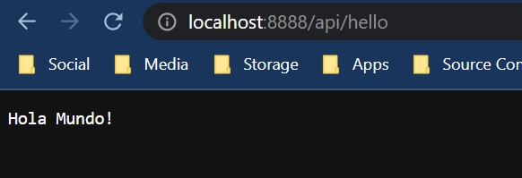

### **Clean Resources**

- To stop container run:

```sh
docker stop containerized-web-api
```

- Because flag --rm was used when container was created container is automatically deleted

- Delete image using

```sh
docker image rm containerized-web-api:latest
```

## **Exercise 2: Cloud Providers**

Once you have containerized your application deployment to any cloud is trivial since most of the cloud providers support containerized applications.

There are three big cloud providers:

- AWS
- Azure
- Google Cloud

In this exercise you will use Azure.

### Publishing image to container registry

To run container we need to put built image somewhere accessible by azure services.
You can host it on any container registry, docker hub provides easy and free access.

- Create account on [docker-hub](https://hub.docker.com/)

- Create new public repository on docker hub:

- In docker desktop login do dockerhub account

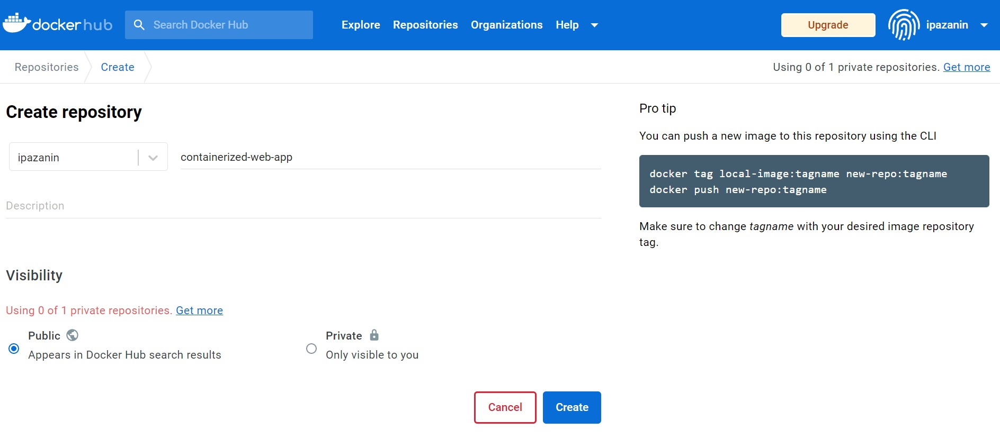

- Tag local image (build it again if you have deleted it) to remote repository:

```sh
docker image tag containerized-web-api:latest {Your Username}/containerized-web-app:latest
docker push {Your Username}/containerized-web-app:latest
```

Here is an example with account username:

```sh
docker image tag containerized-web-api:latest ipazanin/containerized-web-app:latest
docker push ipazanin/containerized-web-app:latest
```

You should be able to see your docker image on docker hub if everything went accordingly:

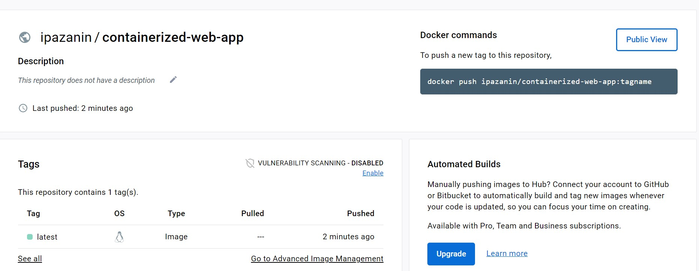

### Creating Azure Student Account

- Go to [Portal](https://portal.azure.com/#home) and login using your fesb account.

- When asked select Azure student benefits:

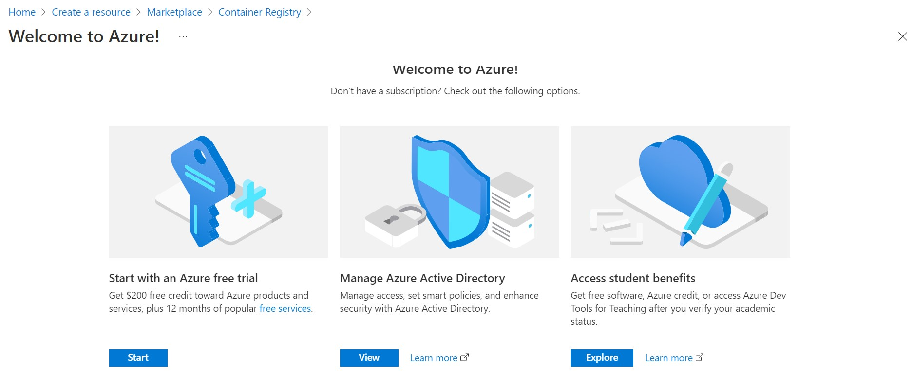

- Sign up for azure for students

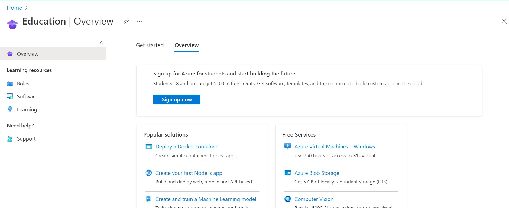

- Follow instructions to finished setting up a free account.

- When all is finished you should have student account with 100$

### Creating Azure Container Instance

- On Azure portal find Container Instances in search and start creating new Container Instance

- Setup basics page similar to this (change docker image path):

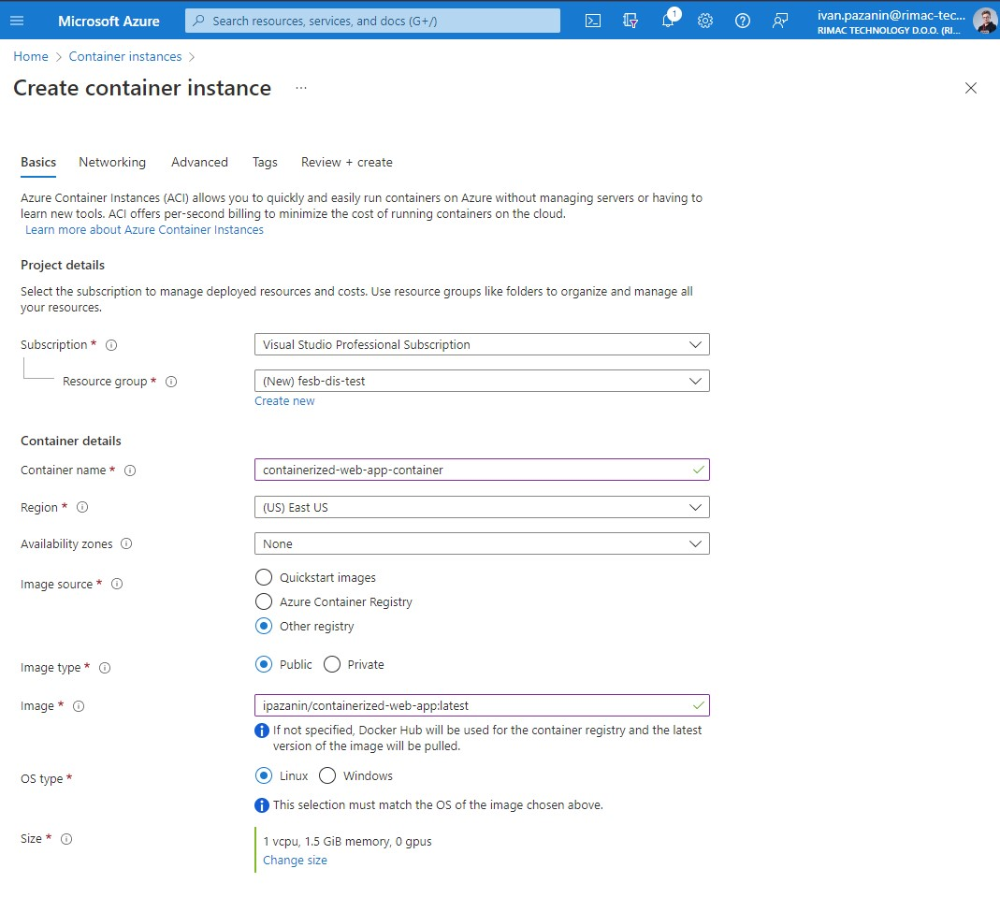

- On Networking tab set DNS name label:

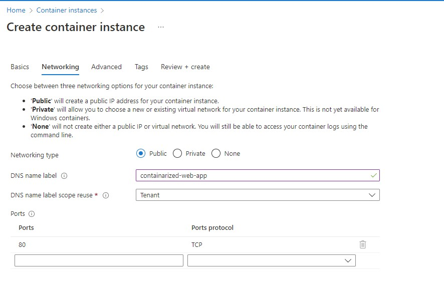

- Review and Create Page:

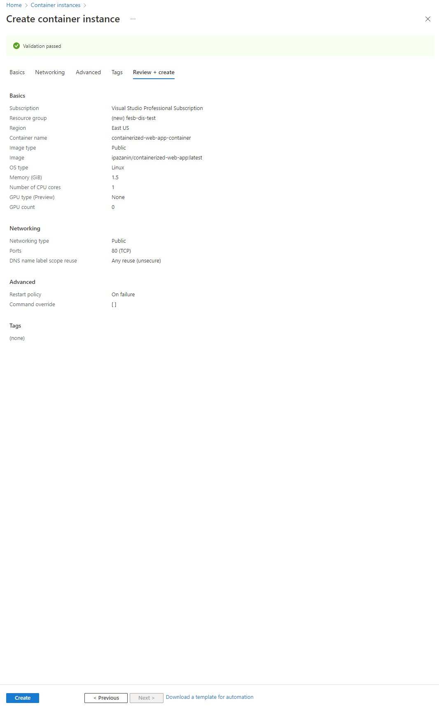

- Press Create to deploy your container image to azure instance

- Wait for deployment to finish and then navigate to created resource:

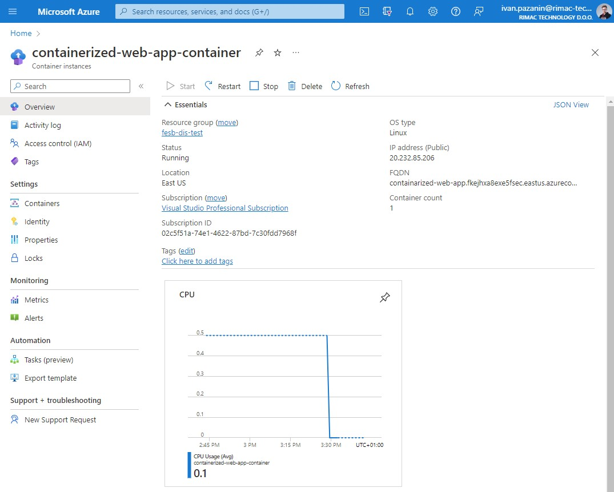

- Wait for few minutes and then try to access web page using DNS name assigned by azure (FQDN)

For example: 

`http://containarized-web-app.fkejhxa8exe5fsec.eastus.azurecontainer.io/api/hello`

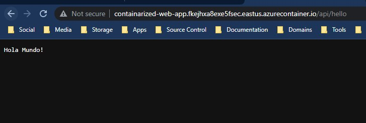

When you are finished, delete azure container instance to save resources!

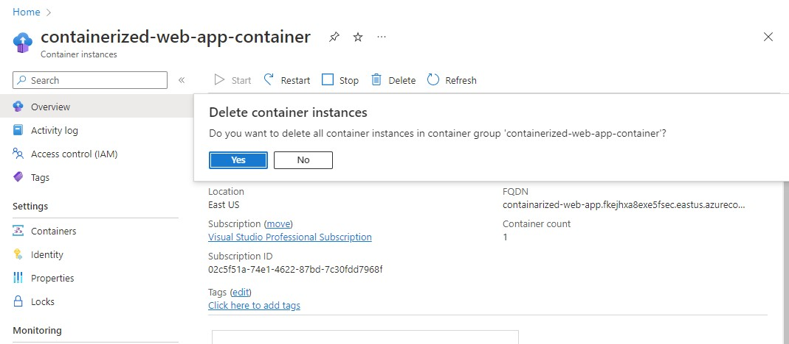