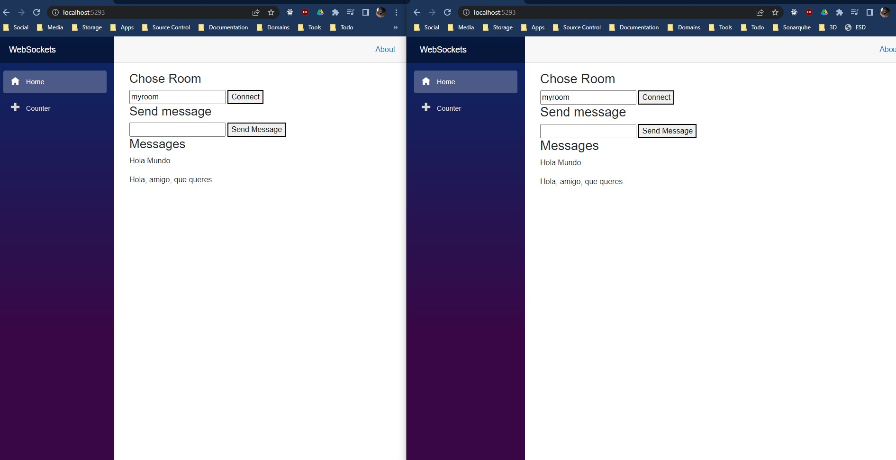

# Lesson
# Lab 8: Web Sockets

## **Table of Contents**

- [Lesson](#lesson)
- [Lab 8: Web Sockets](#lab-8-web-sockets)
  - [**Table of Contents**](#table-of-contents)
    - [**Requirements**](#requirements)
    - [**Objectives**](#objectives)
    - [**Web Sockets**](#web-sockets)
  - [**Exercise 1: Creating WebSocket Server**](#exercise-1-creating-websocket-server)
    - [**Create Project And Solution**](#create-project-and-solution)
  - [**Exercise 2: Creating WebSocket Client**](#exercise-2-creating-websocket-client)
  - [**Exercise 3: Test Solution**](#exercise-3-test-solution)

### **Requirements**

- [.NET 7 SDK](https://dotnet.microsoft.com/en-us/download)

### **Objectives**

In this LAB you will learn about duplex communication on web using web sockets.

### **Web Sockets**

**WebSocket** is a standard protocol that enables a web browser or client application, and a web server application to use a full-duplex connection to communicate.

**HTTP** is not designed for long-lived, real-time, **full duplex** communication between two applications.
In many instances, your web server application or servlet wants to communicate with a client browser or application in a long-lived, real-time, full duplex conversation.
The two applications want to freely read and write data back and forth.
An example is an application that constantly displays changing currency exchange rates on the web browser of a stock trader.
Current **HTTP** technical solutions for this type of communication are cumbersome and inefficient.
**HTTP** solutions for constant two-way communication between a browser and a server mostly consists of either polling or two open **HTTP** connections that handle one-way traffic only, or both.

## **Exercise 1: Creating WebSocket Server**

### **Create Project And Solution**

- Create Solution `WebSockets` and blazor web assembly ASP.NET Core Hosted project `WebSockets.Server`

```sh
dotnet new sln --name WebSockets
dotnet new blazorwasm --name WebSockets --hosted
dotnet sln add WebSockets/Server/WebSockets.Server.csproj
dotnet sln add WebSockets/Client/WebSockets.Client.csproj
dotnet sln add WebSockets/Shared/WebSockets.Shared.csproj
```

- In project `WebSockets.Server` delete `Controllers/WeatherForecastController.cs`:
- In project `WebSockets.Shared` delete `WeatherForecast.cs`:
- In project `WebSockets.Client` delete `Pages/FetchData.cs`:

- In project `WebSockets.Server` Modify class `Program.cs` to look as following:

```csharp
// Program.cs
//
// © 2023 FESB in cooperation with Zoraja Consulting. All rights reserved.
using WebSockets.Server.Services;

var builder = WebApplication.CreateBuilder(args);

// Add services to the container.
builder.Services.AddControllersWithViews();
builder.Services.AddRazorPages();

builder.Services.AddSingleton<ServerChatService>();

var app = builder.Build();

if (app.Environment.IsDevelopment())
{
    app.UseWebAssemblyDebugging();
}

app.UseBlazorFrameworkFiles();
app.UseStaticFiles();

app.UseRouting();

app.MapRazorPages();
app.MapControllers();
app.UseWebSockets();
app.MapFallbackToFile("index.html");

app.Run();

```

- In project `WebSockets.Server` add new service `Services/ServerChatService.cs` with following implementation:

```csharp
using System.Net.WebSockets;
using System.Text;

namespace WebSockets.Server.Services;

public class ServerChatService
{
    private readonly IDictionary<string, IList<WebSocket>> _groupedSockets = new Dictionary<string, IList<WebSocket>>();

    public async Task StartListening(WebSocket webSocket)
    {
        var groupId = await AssignWebSocketToGroup(webSocket);
        await DistributeGroupMessages(groupId, webSocket);
    }

    private async Task<string> AssignWebSocketToGroup(WebSocket webSocket)
    {
        var buffer = new byte[1024 * 4];

        var receiveResult = await webSocket.ReceiveAsync(
                new ArraySegment<byte>(buffer), CancellationToken.None);

        var receivedData = new ArraySegment<byte>(buffer, 0, receiveResult.Count);
        var groupId = Encoding.UTF8.GetString(receivedData);

        if (_groupedSockets.TryGetValue(groupId, out var existingSockets))
        {
            existingSockets.Add(webSocket);
        }
        else
        {
            _groupedSockets[groupId] = new List<WebSocket> { webSocket };
        }

        return groupId;
    }

    private async Task DistributeGroupMessages(string groupId, WebSocket webSocket)
    {
        var buffer = new byte[1024 * 4];

        var receiveResult = await webSocket.ReceiveAsync(
            new ArraySegment<byte>(buffer), CancellationToken.None);

        while (!receiveResult.CloseStatus.HasValue)
        {
            var webSocketGroup = _groupedSockets[groupId];

            foreach (var groupWebSocket in webSocketGroup)
            {
                await groupWebSocket.SendAsync(
                    buffer: new ArraySegment<byte>(buffer, 0, receiveResult.Count),
                    messageType: receiveResult.MessageType,
                    endOfMessage: receiveResult.EndOfMessage,
                    cancellationToken: CancellationToken.None);
            }

            receiveResult = await webSocket.ReceiveAsync(
                buffer: new ArraySegment<byte>(buffer),
                cancellationToken: CancellationToken.None);
        }

        await webSocket.CloseAsync(
            closeStatus: receiveResult.CloseStatus.Value,
            statusDescription: receiveResult.CloseStatusDescription,
            cancellationToken: CancellationToken.None);

        _groupedSockets[groupId].Remove(webSocket);
    }
}

```

- In project `WebSockets.Server` add new controller `Controllers/WebSocketsController.cs` with following implementation:

```csharp
using Microsoft.AspNetCore.Mvc;
using WebSockets.Server.Services;

namespace WebSockets.Server.Controllers;

public class WebSocketController : ControllerBase
{
    private readonly ServerChatService _serverChatService;

    public WebSocketController(ServerChatService serverChatService)
    {
        _serverChatService = serverChatService;
    }

    [Route("/ws")]
    public async Task Get()
    {
        if (HttpContext.WebSockets.IsWebSocketRequest)
        {
            using var webSocket = await HttpContext.WebSockets.AcceptWebSocketAsync();
            await _serverChatService.StartListening(webSocket);
        }
        else
        {
            HttpContext.Response.StatusCode = StatusCodes.Status400BadRequest;
        }
    }
}
```

## **Exercise 2: Creating WebSocket Client**

- In project `WebSockets.Client` modify file `Shared/NavMenu.razor` to look as following:

```html
<div class="top-row ps-3 navbar navbar-dark">
    <div class="container-fluid">
        <a class="navbar-brand" href="">WebSockets</a>
        <button title="Navigation menu" class="navbar-toggler" @onclick="ToggleNavMenu">
            <span class="navbar-toggler-icon"></span>
        </button>
    </div>
</div>

<div class="@NavMenuCssClass nav-scrollable" @onclick="ToggleNavMenu">
    <nav class="flex-column">
        <div class="nav-item px-3">
            <NavLink class="nav-link" href="" Match="NavLinkMatch.All">
                <span class="oi oi-home" aria-hidden="true"></span> Home
            </NavLink>
        </div>
        <div class="nav-item px-3">
            <NavLink class="nav-link" href="counter">
                <span class="oi oi-plus" aria-hidden="true"></span> Counter
            </NavLink>
        </div>
    </nav>
</div>

@code {
    private bool collapseNavMenu = true;

    private string? NavMenuCssClass => collapseNavMenu ? "collapse" : null;

    private void ToggleNavMenu()
    {
        collapseNavMenu = !collapseNavMenu;
    }
}
```

- In project `WebSockets.Client` modify file `Program.cs` to look as following:

```csharp
using System.Net.WebSockets;
using Microsoft.AspNetCore.Components.Web;
using Microsoft.AspNetCore.Components.WebAssembly.Hosting;
using WebSockets.Client;
using WebSockets.Client.Services;

var builder = WebAssemblyHostBuilder.CreateDefault(args);
builder.RootComponents.Add<App>("#app");
builder.RootComponents.Add<HeadOutlet>("head::after");

builder.Services.AddScoped(sp => new HttpClient { BaseAddress = new Uri(builder.HostEnvironment.BaseAddress) });
builder.Services.AddTransient<ClientChatService>();

await builder.Build().RunAsync();
```

- In project `WebSockets.Client` create file `Services/ClientChatService.cs` to look as following:

```csharp
using System.Net.WebSockets;
using System.Runtime.CompilerServices;
using System.Text;
using Microsoft.AspNetCore.Components;

namespace WebSockets.Client.Services;

public class ClientChatService : IDisposable
{
    private readonly ClientWebSocket _websocket;
    private readonly Uri _websocketUrl;
    private bool _disposedValue;

    public ClientChatService(NavigationManager navigationManager)
    {
        _websocket = new ClientWebSocket();
        _websocketUrl = new Uri(navigationManager.BaseUri.ToString().Replace("http", "ws") + "ws");
    }

    public async Task ConnectAsync(string groupId, CancellationToken cancellationToken)
    {
        await _websocket.ConnectAsync(_websocketUrl, cancellationToken);

        await SendStringAsync(groupId, cancellationToken);
    }

    public async IAsyncEnumerable<string> ListenForMessages([EnumeratorCancellation] CancellationToken cancellationToken)
    {
        var buffer = new ArraySegment<byte>(new byte[2048]);

        while (!cancellationToken.IsCancellationRequested)
        {
            WebSocketReceiveResult receivedResult;
            using var ms = new MemoryStream();
            do
            {
                receivedResult = await _websocket.ReceiveAsync(buffer, cancellationToken);
                ms.Write(buffer.Array!, buffer.Offset, receivedResult.Count);
            } while (!receivedResult.EndOfMessage);

            _ = ms.Seek(0, SeekOrigin.Begin);

            yield return Encoding.UTF8.GetString(ms.ToArray());

            if (receivedResult.MessageType == WebSocketMessageType.Close)
            {
                break;
            }
        }
    }

    public Task SendStringAsync(string data, CancellationToken cancellation)
    {
        var encoded = Encoding.UTF8.GetBytes(data);
        var buffer = new ArraySegment<byte>(encoded, 0, encoded.Length);

        return _websocket.SendAsync(
            buffer: buffer,
            messageType: WebSocketMessageType.Text,
            endOfMessage: true,
            cancellationToken: cancellation);
    }

    protected virtual void Dispose(bool disposing)
    {
        if (!_disposedValue)
        {
            if (disposing)
            {
                _websocket.Dispose();
            }

            _disposedValue = true;
        }
    }

    public void Dispose()
    {
        Dispose(disposing: true);
        GC.SuppressFinalize(this);
    }
}

```

- In project `WebSockets.Client` create file `Pages/IndexBase.cs` to look as following:

```csharp
// IndexBase.cs
//
// © 2023 FESB in cooperation with Zoraja Consulting. All rights reserved.

using Microsoft.AspNetCore.Components;
using WebSockets.Client.Services;

namespace WebSockets.Client.Pages;

public class IndexBase : ComponentBase
{
    [Inject]
    public ClientChatService ClientChatService { get; init; } = null!;

    protected IList<string> ReceivedMessages { get; } = new List<string>();

    protected string NewMessageValue { get; set; } = string.Empty;
    protected string RoomId { get; set; } = string.Empty;

    protected async Task ConnectToRoom()
    {
        await ClientChatService.ConnectAsync(RoomId, default);

        _ = Task.Run(ReceiveMessages);
    }

    protected async Task SendNewMessage()
    {
        await ClientChatService.SendStringAsync(NewMessageValue, default);

        NewMessageValue = string.Empty;
    }

    private async Task ReceiveMessages()
    {
        var incomingMessages = ClientChatService.ListenForMessages(default);

        await foreach (var message in incomingMessages)
        {
            ReceivedMessages.Add(message);
            StateHasChanged();
        }
    }
}
```

- In project `WebSockets.Client` modify file `Pages/Index.razor` to look as following:

```html
@page "/"
@inherits IndexBase

<PageTitle>Messages</PageTitle>

<h3>Chose Room</h3>
<input @bind-value="@RoomId" />
<button onclick="@ConnectToRoom">Connect</button>

<h3>Send message</h3>

<input @bind-value="@NewMessageValue" />
<button onclick="@SendNewMessage">Send Message</button>

<h3>Messages</h3>

@foreach (var message in ReceivedMessages)

{
    <p>@message</p>

}
```


## **Exercise 3: Test Solution**

- run project:

```sh
dotnet run --project WebSockets/Server/WebSockets.Server.csproj
```

- open two tabs, and connect to same room

- try sending messages and observe results

