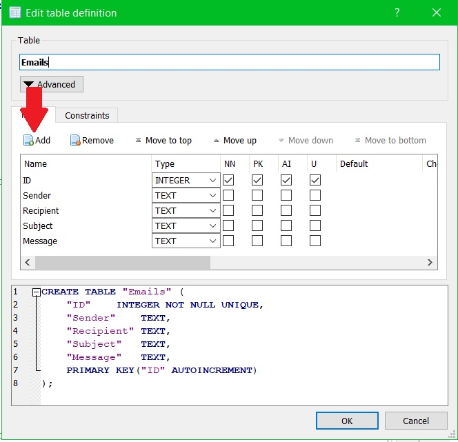
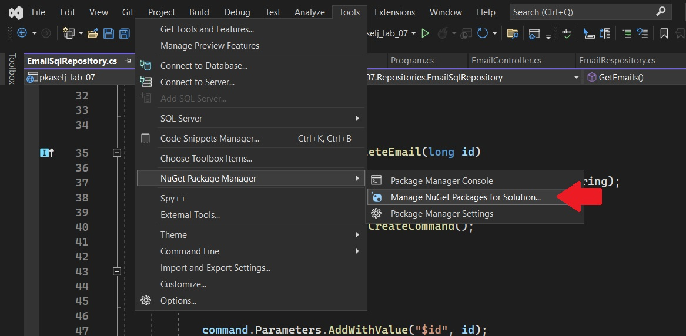
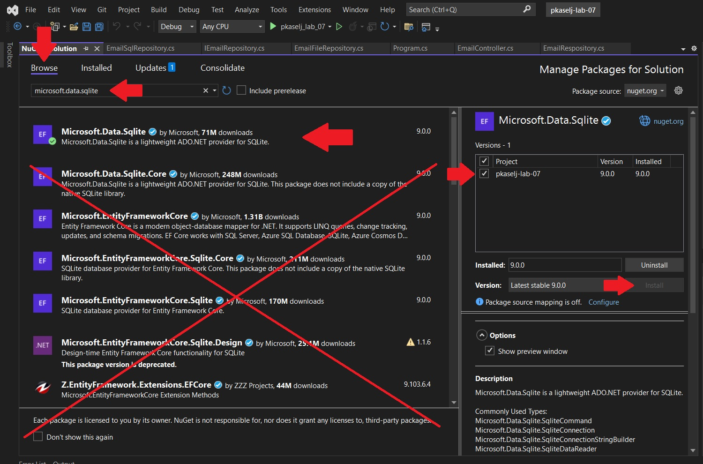

# Phase 2 - Notes

## Table Of Contents

- [Phase 2 - Notes](#phase-2---notes)
  - [Table Of Contents](#table-of-contents)
  - [**Steps for Creating a Basic WebAPI**](#steps-for-creating-a-basic-webapi)
  - [**Hints**](#hints)
    - [**General**](#general)
    - [**Creating a Database**](#creating-a-database)
    - [**Installing SQLite NuGet Package**](#installing-sqlite-nuget-package)
  - [Further Reading](#further-reading)

## **Steps for Creating a Basic WebAPI**

1. Pull master branch
	1. Git checkout master
	2. Git pull
	3. Git checkout dev
2. After merging PR, create tag 1.0.0 (git push --tags)
	1. Git checkout master
	2. Git tag 1.0.0
	3. Git push --tags
	4. Git checkout dev
3. Refactor EmailRepository
	1. Add public methods, copy from controller
	2. Set Emails to private
4. Create IEmailRepository
	1. Refactor EmailRepositroy to inherit from IEmailRepository
5. Create a Database in SQLite DBBrowser
   1. `File > New Database` ...
   2. Create table Emails
		1. Check ID column attributes: NN, AI, U, PK
	3. `File > Write Changes`
6. Install NuGet Package Microsoft.Data.SQLite (not core, from browse, not installed)
7. Create EmailSqlRepository that inherits from IEmailRepository
	1. Implement all functions (at least CREATE, READ, UPDATE, DELETE)
8. Add constructors
9.  Register singleton service [HINT](https://github.com/fesb-distributed-systems-2024/pkaselj-lab-07/blob/cd2e59e6ca4265b0ed48a8627b607d66ee20b671/Program.cs#L14)

## **Hints**

### **General**

- Do not forget to set ID field of your model to 0 instead of generating a random number.
- Do not forget to `File > Write Changes` in DB Browser for SQLite if you change anything.
- Do not forget to change connection string in your repository. [HINT](https://github.com/fesb-distributed-systems-2024/pkaselj-lab-07/blob/cd2e59e6ca4265b0ed48a8627b607d66ee20b671/Repositories/EmailSqlRepository.cs#L9)
- Do not forget to install `Microsoft.Data.SQLite` and not any other like `Microsoft.Data.SQLite.Core` etc.
- Refer to the [pkaselj-lab-07 GitHub Repo](https://github.com/fesb-distributed-systems-2024/pkaselj-lab-07) for reference implementation.
- Refer to the [pkaselj-lab-07-plus GitHub Repo](https://github.com/fesb-distributed-systems-2024/pkasel-lab-07-plus) for last year's full project implementation.
- Use [Postman](https://www.postman.com/) for testing the API
- Use [DB Browser for SQLite for testing the database](https://sqlitebrowser.org/)

### **Creating a Database**

### **Installing SQLite NuGet Package**

## Further Reading
- [W3Schools SQL](https://www.w3schools.com/sql/default.asp)
- [Official SQLite Webpage](https://www.sqlite.org/)

