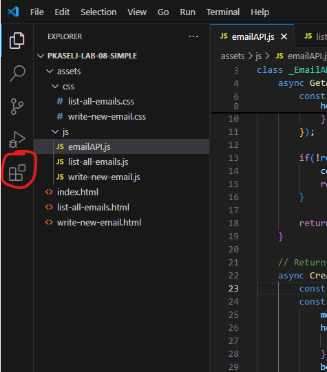
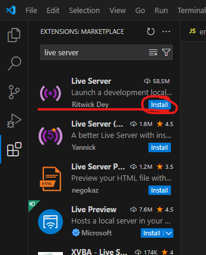
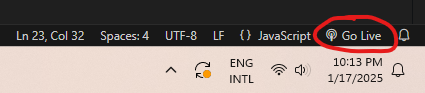

# Phase 5 - Notes

## Table Of Contents

- [Phase 5 - Notes](#phase-5---notes)
  - [Table Of Contents](#table-of-contents)
  - [**Hints**](#hints)
    - [**General**](#general)
  - [Further Reading](#further-reading)
  - [Installing *Live Server* Extension in *Visual Studio Code*](#installing-live-server-extension-in-visual-studio-code)
  - [Start Hosting Your Web Page in *Visual Studio Code*](#start-hosting-your-web-page-in-visual-studio-code)

## **Hints**
- Do not forget to enable CORS on backend.
  - For more information refer to this [COMMIT in pkaselj-lab-07](https://github.com/fesb-distributed-systems-2024/pkaselj-lab-07/commit/cf4161ad17556f95774907434c4ff76a6b78843a) repo
- Do not forget to refer to this [COMMIT in pkaselj-lab-08-simple](https://github.com/fesb-distributed-systems-2024/pkaselj-lab-08-simple/commit/438001f60b17d28d03d518af2ab2352089e36657) repo to see how to adjust given frontend for your backend.
- Install `Live Server` extension in `Visual Studio Code` to serve your frontend page locally (more information below)
- Do not forget that the frontend must send objects that your controller expects i.e. your DTOs

### **General**
- Refer to the [pkaselj-lab-07 GitHub Repo](https://github.com/fesb-distributed-systems-2024/pkaselj-lab-07) for reference implementation.
- Refer to the [pkaselj-lab-08-simple GitHub Repo](https://github.com/fesb-distributed-systems-2024/pkaselj-lab-08-simple) for reference implementation of basic frontend in HTML and CSS.
- Refer to the [pkaselj-lab-08 GitHub Repo](https://github.com/fesb-distributed-systems-2024/pkaselj-lab-08) for reference implementation of a frontend web page using Bootstrap.
- Refer to the [pkaselj-lab-07-plus GitHub Repo](https://github.com/fesb-distributed-systems-2024/pkasel-lab-07-plus) for last year's full project implementation.
- Use [regexr](https://regexr.com/) to practise regular expressions

## Further Reading
- For more information on CSS preprocessors:
  - [Official SASS Page](https://sass-lang.com/)
- For more information on JavaScript alternatives:
  - [Official TypeScript Page](https://www.typescriptlang.org/)
  - [Official WebAssembly Page](https://webassembly.org/)
- For more information on CSS UI libraries:
  - [Official Bootstrap Page](https://getbootstrap.com/)
  - [Official Tailwind CSS Page](https://tailwindui.com/)
  - [Official Material UI Page](https://mui.com/)
- For more information on JavaScript libraries/frameworks:
  - [Official React Page](https://react.dev/)
  - [Official Angular Page](https://angular.dev/)
  - [Official Vue.js Page](https://vuejs.org/)
  - [Official Svelte Page](https://svelte.dev/)
  - [Official Blazor Page](https://dotnet.microsoft.com/en-us/apps/aspnet/web-apps/blazor)
- Great channel with short overviews on web development:
  - [Fireship.io Page](https://fireship.io/) 
  - [Fireship.io YouTube Channel](https://www.youtube.com/c/Fireship)

## Installing *Live Server* Extension in *Visual Studio Code*

1. Open *Extensions* tab in *Visual Studio Code* as in figure below
   

2. Search for, and install, *Live Server* extension

## Start Hosting Your Web Page in *Visual Studio Code*
1. In the lower right corner of the *VS Code*, press the button *Go Live*

2. Alternatively, go to the tool bar in the upper right corner, *View* > *Command Palette...* > "*> Live Server: Open with Live Server*"